# 操作系统实验报告

## 实验基本信息

| 项目 | 内容 |
|------|------|
| **实验名称** | Lab 1: 最小可执行内核与启动流程 |
| **小组成员** | 2410665-殷佳仪、2410749-宋秋实、2412090-兰雨杉 |
| **完成日期** | 2026-10-7 |

### 小组分工

#### 分工（练习与功能模块）

| 成员 | 负责的练习/模块 |
|------|----------------|
| 2410665-殷佳仪（组长） | **练习 1**（内核入口操作：`la sp, bootstacktop` 与 `tail kern_init`）、**功能模块四**（QEMU 7.0 环境适配排障：把根因定位到 `fw_dynamic_info.next_addr` 字段）、**功能模块五**（六组深度对照实验与结论修正）、全文统稿与终审 |
| 2410749-宋秋实 | **练习 2**（用 GDB 从加电复位跟踪到内核第一条指令 `0x80200000`）、**功能模块二**（启动链 GDB 观测脚本与会话证据）、第五节 测试与验证（`make qemu` 截图 + harness 等效验收） |
| 2412090-兰雨杉 | **拓展**（现代笔记本的启动流程对照）、**功能模块一**（交叉编译与镜像生成：命令级取证与可复现性）、**功能模块三**（启动链证据台账与验收判据）、第六节 实验总结、仓库整理与提交 |

#### 分工（报告撰写与交叉复核）

| 成员 | 撰写章节 | 必须完成的交叉复核动作（复核通过与否决定该节能否定稿） |
|------|---------|--------------------------------------------------|
| 2410665-殷佳仪 | 基本信息、§一 目的、§二 环境、§三 逻辑主线与逐步实现、练习 1、功能模块四/五、§六 独到理解与组长统筹、附录 | 复核 2412090-兰雨杉 的知识点对照表：逐行检查"差异"列是否有实测支撑，凡出现"应该/通常"一律打回重写 |
| 2410749-宋秋实 | 练习 2、功能模块二、§五 测试与验证、自测判据表 | 复核 2410665-殷佳仪 的练习 1 证据链：用 `objdump` 与 `p/x &bootstacktop` 现场复现全部关键数字；复核六组对照实验的可重跑性 |
| 2412090-兰雨杉 | 拓展、功能模块一/三、§六 总结与收获、仓库与提交 | 复核 2410749-宋秋实 的判据表：十一条判据逐条现场重跑，不能复现的判据一律删除；复核台账每条是否给出可重放命令 |

> **本组分工的说明**：本实验按**交付物**切分，每件交付物只有一位负责人，
> 但三人共用同一套可复现脚本（`lab1/scripts/01–19`）与同一份原始证据（`lab1/logs/`），
> 因此**任何一节结论都能被其他成员独立重放**。
> 我们把"分工"落实为三层责任：**① 谁写（撰写）② 谁验（交叉复核）③ 谁能现场答（答辩责任区）**——
> 只写不验的章节不予定稿。这既是对"防划水"的具体回应，也是本报告每个数字都可追溯的原因。

---

## 一、实验目的

本实验的主要目的是：

1. **认识"内核如何被启动"这一通常被跳过的前置问题**：掌握**链接脚本**如何描述内存布局
   （`.text / .rodata / .data / .sdata / .bss` 各自语义、`BASE_ADDRESS = 0x80200000` 从何而来），
   并理解内核第一条指令为什么必须落在 `0x80200000` —— 它不是一个"随便选的地址"，
   而是**上游（QEMU/OpenSBI）与下游（链接脚本）之间的接口契约**；我们进一步用 OpenSBI 横幅里的
   固件占用区与 PMP 区域，给出了"为什么是这个数值"的量化回答（见 §四 模块四）。
2. **掌握交叉编译与内核镜像生成的完整流水线**：`gcc -c`（8 个源文件，带完整 CFLAGS）→
   `ld -T tools/kernel.ld`（决定地址布局、段裁剪与入口落位）→ `objcopy -O binary`（去符号、按 LMA 线性展开）；
   能解释 ELF（48752 B，给调试器）与 BIN（12296 B，给加载器）两种格式的分工与体积差的**逐字节来源**；
   并进一步验证**同一源码在同一工具链下可逐字节复现同一镜像**（§二 4）。
3. **理解固件（OpenSBI）作为 bootloader 的职责与 RISC-V 特权级边界**：从复位地址 `0x1000` 的
   **6 条指令**，经 `0x80000000` 的固件初始化，到 `0x80200000` 把控制权移交内核；
   并学会用 **GDB + QEMU 双视角**把这条链条验证出来——不仅用 GDB 单步，
   还用 QEMU 自己的 `-d in_asm` 日志把**特权级轨迹**（M → S →（ecall）→ M → S）完整记录（§四 模块五）。
4. **掌握"在什么都没有的环境里造运行时"的方法，并体会 AI 协作开发的正确姿势**：
   内核不能依赖 libc，只能通过 `ecall` 调用 SBI 服务，自底向上封装出
   `sbi_console_putchar → cons_putc → cputch → vprintfmt → cprintf` 这条打印链；
   同时按指导书 lab0.5 的范式（从"怎么做"到"做什么"）练习**需求分析、系统思维、验证、迭代**四种能力，
   使 AI 产出的一切结论都可被脚本复核——**我们才是系统的最终负责人**。

---

## 二、实验环境

### 1. 你们使用的 AI 工具

| 成员 | AI 编程工具 | 底层模型 | 备注 |
|------|------------|---------|------|
| 2410665-殷佳仪 | DeepSeek Harness（DSH，Web GUI 终端 Agent） | DeepSeek-V4-Flash | 组长机兼实验机：Windows + WSL2 Ubuntu 22.04.5，RISC-V 工具链与 QEMU 就绪 |
| 2410749-宋秋实 | DeepSeek Harness | DeepSeek-V4-Flash | 负责 GDB 观测脚本与会话证据；用同一套脚本独立复跑 |
| 2412090-兰雨杉 | DeepSeek Harness | DeepSeek-V4-Flash | 负责构建取证、台账判据复核与仓库提交 |

**说明：**
- **AI 编程工具**：DeepSeek Harness 是能读写项目文件、执行 shell 命令的终端 Agent；本实验用它完成
  "读源码 → 写复现脚本 → 跑 QEMU/GDB → 落盘证据 → 交叉复核"的全过程。
- **底层模型**：三人统一 DeepSeek-V4-Flash。
- **AI 的角色边界（重要）**：lab1 没有任何代码填空，所以 AI 在本章的产出**不是内核代码**，
  而是**观测脚本、证据台账、排障结论与对照实验设计**；这些产出全部要求可被脚本复核。
  我们把这条边界直接写进了提示词的 `[PROMPT] → 操作要求`：
  "必须在项目内创建真实文件；**不得修改** `kern/ libs/ tools/ Makefile` 下的任何文件"。
  **本章我们让 AI 干的是"取证与验证"，而不是"写功能"**，这恰好对应 lab0.5 所说的
  "从实现者变成设计者"——只不过 lab1 的设计对象不是代码，而是**判据与实验**。

### 2. 运行环境

| 项目 | 实测值 | 证据 |
|------|-------|------|
| 宿主 | Windows 笔记本 + **WSL2 Ubuntu 22.04.5 LTS**（`6.6.87.2-microsoft-standard-WSL2`） | `lab1/logs/run/01-prepare-and-build.log` |
| 交叉工具链 | `/opt/riscv/bin`：`riscv64-unknown-elf-gcc 10.2.0 (SiFive GCC-Metal 10.2.0-2020.12.8)`、`ld 2.35`、`gdb 10.1` | 同上（截图 `images/shot-EV1-toolchain.png`） |
| 模拟器 | `/opt/qemu/bin/qemu-system-riscv64`，**QEMU 7.0.0**（指导书要求 ≥ 4.1.0）；对照：apt 版 `/usr/bin/qemu-riscv64` = 6.2.0（过旧，未使用） | 同上 |
| 固件 | QEMU `-bios default` → `opensbi-riscv64-generic-fw_dynamic.bin`（105296 B），**OpenSBI v1.0**（Runtime SBI Version 0.3，Firmware Size 252 KB） | 同上 + `logs/run/02A/02B` |
| 目标机 | QEMU `virt` 机型，单 hart（`mhartid = 0`），物理内存 128 MiB（DTB 实测 `0x80000000 + 0x08000000`） | EV-28 |

### 3. 三份"接口契约"的实测落点

| 契约 | 约定的值 | 实测证据 |
|------|---------|---------|
| 链接期：内核入口 | `kern_entry = 0x80200000` | `readelf -h` 的 `Entry point address`；`nm` 符号表 |
| 固件→内核：跳转地址 | `fw_dynamic_info.next_addr = 0x80200000`（结构体偏移 `0x1038`） | GDB 会话 D2（EV-20） |
| 固件→内核：寄存器传参 | `a0 = hartid`、`a1 = 设备树地址 = 0x87000000`、`a2 = fw_dynamic_info = 0x1028` | GDB 会话 B/E（EV-14、EV-15、EV-28） |

### 4. 内核镜像的内存布局（实测）

| 段 | 大小 | 起始地址 | 内容与说明 |
|---|---|---|---|
| `.text` | 1224 B | `0x80200000` | 代码；**第一个字节就是 `kern_entry` 的第一条指令**（`xxd` 首行 `1731 0000 1301 0100 09a0`） |
| `.rodata` | 624 B | `0x802004c8` | 只读常量，含 `(THU.CST) os is loading ...\n`（`0x802004c8`）与格式串 `%s\n\n`（`0x802004e8`） |
| `.data` | 8192 B | `0x80201000` | **内核栈 `bootstack`**（`KSTACKSIZE = 2 × 4096`），全 0 |
| `.sdata` | 8 B | `0x80203000` | `SBI_CONSOLE_PUTCHAR = 1`（实测节内容 `01000000 00000000`）；该节**起始地址**恰好等于 `bootstacktop` |
| `.bss` | **0 B** | — | 本构建中不存在该节；`edata == end == 0x80203008`（机理见 §四 模块五 实验 4） |

**镜像足迹表**：

| 符号 | 值 | 含义 |
|---|---|---|
| `entry` | `0x80200000` | 内核入口（= ELF 头 `Entry point address`） |
| `etext`（链接脚本 `PROVIDE(etext = .)`） | `0x802004c8` | `.text` 结束地址；**因本工程无任何代码引用该符号，链接器不把它写入符号表**（`nm`/`readelf -s` 均查不到），故它是"布局事实"而非"可 `nm` 验证的符号"——实测依据取 `.rodata` 的起始地址 |
| `edata` | `0x80203008` | 数据段结束 = `.bss` 起点（本构建等于 `end`） |
| `end` | `0x80203008` | 内核镜像内存映像的末尾 |
| 镜像足迹 | `12296 B ≈ 12 KiB`（BIN）；ELF 48752 B 中的其余部分为调试信息 | 加载器真正需要搬进内存的字节数 |

### 5. 构建命令与可复现性（额外补充）

指导书只给出 `make` 的概要（`+ cc` / `+ ld`）。为了把"编译链接"讲到底，我们用 **`make V=`**
（让 Makefile 里的 `$(V)` 展开为空）回显了**完整命令行**，实测如下（完整日志
`lab1/logs/build-commands.txt`）：

```bash
# ① 编译单个源文件（以 entry.S 为例；实际 8 个源文件各执行一次）
riscv64-unknown-elf-gcc -Ikern/init/ -mcmodel=medany -std=gnu99 -Wno-unused -Werror \
  -fno-builtin -Wall -O2 -nostdinc -fno-stack-protector -ffunction-sections -fdata-sections -g \
  -Ilibs -Ikern/debug/ -Ikern/driver/ -Ikern/trap/ -Ikern/libs/ -Ikern/mm/ -Ikern/arch/ \
  -c kern/init/entry.S -o obj/kern/init/entry.o

# ② 链接（注意输入文件顺序：entry.o 排第一 —— 这是入口落在 0x80200000 的直接原因）
riscv64-unknown-elf-ld -m elf64lriscv -nostdlib --gc-sections -T tools/kernel.ld -o bin/kernel \
  obj/kern/init/entry.o obj/kern/init/init.o obj/kern/libs/stdio.o obj/kern/driver/console.o \
  obj/libs/printfmt.o obj/libs/readline.o obj/libs/sbi.o obj/libs/string.o

# ③ 去符号、按 LMA 生成 BIN 镜像
riscv64-unknown-elf-objcopy bin/kernel --strip-all -O binary bin/ucore.img
```

**每个编译/链接参数的用意**：

| 参数 | 作用 | 去掉会怎样 |
|---|---|---|
| `-mcmodel=medany` | 允许用 `auipc+addi` 访问任意 64 位地址（实测全内核 `lui` 出现 **0** 次、`auipc` **15** 次） | 默认 `medlow` 可能生成 `lui/addi` 绝对寻址，且无法访问超出 ±2GB 的符号 |
| `-nostdinc` | 不用系统头文件，只用内核自带的 `libs/defs.h` 等 | 会引入 glibc 头文件，最终依赖不存在的系统调用 |
| `-fno-builtin` | 禁止把 `memset` 等识别成编译器内建 | 编译器可能内联或改写我们自己实现的 `memset`，行为不可控 |
| `-fno-stack-protector` | 不插栈保护 canary | 需要 `__stack_chk_fail`，而内核里没有该函数 → 链接失败 |
| `-ffunction-sections -fdata-sections` + `--gc-sections` | 每个函数/数据独立成节，链接时丢弃未引用者 | 镜像会带上 `readline.c`、`getchar` 等无用代码（实测最终只保留 11 个函数） |
| `-g` | 保留调试信息（留在 ELF，不进 BIN） | GDB 无法按源码行断点（`entry.S:7` 这类信息将消失） |
| `-T tools/kernel.ld` | 用我们的链接脚本决定内存布局 | 会用默认脚本链成"Linux 应用"式布局，入口不在 `0x80200000` |
| `--strip-all`（objcopy） | 镜像不带符号表 | BIN 会无谓变大；符号只对 GDB 有意义（故保留在 `bin/kernel` 中） |

**riscv64 版镜像生成依赖树（对照 x86 版 ucore 的 bootblock/sign.c/dd 分支）**：

```
kern/**/*.c, *.S ──gcc -c──► obj/**.o ──ld -T tools/kernel.ld──► bin/kernel (ELF, 带符号)
                                                                        │
                                                       objcopy --strip-all -O binary
                                                                        ▼
                                                              bin/ucore.img (BIN, 12296 B)
                                                                        │
                                                  QEMU/KVM：-kernel 把它放进 0x80200000
                                                                        ▼
                                                            OpenSBI：mret 到 0x80200000
```

> **与 x86 版 lab1 的关键差异**：x86 版镜像需要
> `bootasm.S + bootmain.c + sign.c`、512 字节主引导扇区、`0x55AA` 签名、`0x7C00` 与 `0x100000` 等；
> **riscv64 版没有这些步骤**——镜像生成只需 `objcopy` 一步，因为"把内核放进内存"由 QEMU 主机侧完成
> （见 §四 模块四与 §六 独到理解 3）。这也是我们在报告中不照搬任何 x86 结论的原因。

**可复现性验证（确定性重编译）**：在做上述取证时我们得到一个强结论——
`make clean && make V=` **前后**，两个产物的 sha256 **完全相同**：

```
构建前： bin/kernel    d2f872c437df8e62217ca506544bb5af212bfa3a1ea82132e4c1eefb910be739
         bin/ucore.img a21c11243b36836e7c42ffa13b0539a1cd2ee712386bd0b4cd60468b1c3467fd
构建后： bin/kernel    d2f872c437df8e62217ca506544bb5af212bfa3a1ea82132e4c1eefb910be739
         bin/ucore.img a21c11243b36836e7c42ffa13b0539a1cd2ee712386bd0b4cd60468b1c3467fd
         （两者均 48752 B / 12296 B）
```

⇒ **同一份源码 + 同一套工具链 = 逐字节相同的镜像**。这条结论有两个用途：
① 它使本报告所有体积账 / 符号表 / 反汇编结论具备**可复算性**（别人重编译后拿到的是同一个文件，
   可以让 `sha256sum` 与我们的记录逐字节对上）；
② 它反向证明后续取证过程**没有污染工作副本**（否则 sha256 必然变化）——
   这也正是我们敢在报告里反复声明"源码零改动"的底气。

### 6. 提交到仓库的代码说明（"零改动"的准确含义）

本组仓库（`https://github.com/yin102570/riscv64-ucore-lab-2026`）的约定是：**一个分支对应一次实验**，
分支顶层只放 `code/` 与 `report/{report.md, prompt.md, images/}`（见仓库 `main` 分支的 `README.md`）。
按此约定，Lab 1 的提交内容与下面几点需要说明清楚，以免"源码零改动"这句话被误读：

| 项目 | 事实 | 如何核对 |
|---|---|---|
| `code/` 内容 | 老师提供的 lab1 起始源码 **21 个文件**（其中 **8 个参与编译**：7 个 `.c` + 1 个 `.S`；其余是头文件、`Makefile`、`kernel.ld`、`function.mk`）；本组另加了 1 个 `.gitignore`，故 `code/` 共 **22 个文件** | `code/` 目录清单 |
| 其中 20 个文件 | 与老师给的骨架**逐字节相同**（git blob 哈希比对） | `git hash-object` 比对结果 |
| **唯一差异：`code/Makefile`** | 为在本机 **QEMU 7.0.0** 上"开箱即跑"做了 3 处环境适配（见下） | 与 `lab1-源码存档/lab1/Makefile` 对比 |
| 构建产物 `bin/ obj/` | **不入库**（仓库 `code/.gitignore` 已忽略），但其 sha256 与体积写在报告 §五(8) 中 | 见 §五(8) 与 EV-33 |
| 截图 | 全部随报告提交到 `report/images/`（25 处在报告中以 `./images/...` 引用） | GitHub 上报告可直接显示 |

**`code/Makefile` 的 3 处适配**：

```diff
 qemu: $(UCOREIMG) $(SWAPIMG) $(SFSIMG)
 	$(V)$(QEMU) -machine virt -nographic -bios default \
-		-device loader,file=$(UCOREIMG),addr=0x80200000
+		-kernel $(UCOREIMG)
 debug: $(UCOREIMG) $(SWAPIMG) $(SFSIMG)
 	$(V)$(QEMU) -machine virt -nographic -bios default \
-		-device loader,file=$(UCOREIMG),addr=0x80200000 \
+		-kernel $(UCOREIMG) \
 		-s -S
 gdb:
-	riscv64-unknown-elf-gdb \
+	gdb-multiarch \
 	    -ex 'file bin/kernel' -ex 'set arch riscv:rv64' -ex 'target remote localhost:1234'
```

**为什么要改（根因见功能模块四）**：本机 `-bios default` 加载的是 **`fw_dynamic`**，
它必须从 `fw_dynamic_info.next_addr` 取跳转地址；而 `-device loader` 只写内存、**不设置该字段**，
于是 `Domain0 Next Address = 0x0`、内核一行都不执行。加 `-kernel` 后 `next_addr = 0x80200000`，问题解决。

**"源码零改动"的准确含义**：
① **老师给的 lab1 骨架**（存档于 `lab1-源码存档/lab1/`，附 `SHA256SUMS.txt`）**逐字节未改**，
   21/21 文件哈希可核对；本报告的全部实验与结论都基于这份未改动的骨架；
② 仓库 `code/Makefile` 的这 3 行是**已逐行说明的环境适配**，不是"偷偷改代码"；
③ 我们**同时验证过"完全不改 Makefile"的等价做法**——用 make 命令行变量覆盖
   `make qemu QEMU='qemu-system-riscv64 -kernel bin/ucore.img'`（EV-7、EV-33），
   这也是 harness 能跑出 `ALL PASS` 的方式。两种方式在本机都通过，判据完全相同。

> 说明：`gdb` 目标使用 `gdb-multiarch` 是本组仓库既有的写法；本机验证时我们使用工具链自带的
> `riscv64-unknown-elf-gdb`（即原始 Makefile 的写法），二者对 `file bin/kernel` +
> `set arch riscv:rv64` + `target remote` 这三个动作等价。

---

## 三、实验整体逻辑分析

### 3.1 本章节的逻辑主线

**一句话主线：把"一个躺在磁盘上的文件"变成"一台机器上正在运行的最小内核"。**

本章不实现任何业务功能（没有进程、没有内存分配、没有中断），它解决的是一个更底层、
也更容易被跳过的问题：**内核怎样才能被"正确地启动"**。围绕这个问题，本章实际在建立并验证
**三份契约**——这是我们组对本章的核心理解模型：

| 契约 | 双方 | 内容 | 一旦不满足会怎样 | 本章的验证方式 |
|------|------|------|----------------|--------------|
| ① **布局契约** | 链接脚本 ↔ 加载器/固件 | 镜像必须被加载到 `0x80200000`，且**第一条指令就在镜像开头** | 固件跳到别处，取到错误指令或空内存 | `readelf -h` 的 `Entry point`、`xxd -l 16` 看首字节、`objdump -d <kern_entry>` |
| ② **交接契约** | 固件（OpenSBI） ↔ 内核 | 固件跳 `0x80200000`，并用 `a0=hartid`、`a1=设备树`、`a2=fw_dynamic_info` 传参；内核第一条指令必须建立自己的栈 | `next_addr` 为 0 则固件跳到地址 0（本实验真实踩到，见模块四）；没有栈则第一条 C 指令就写坏内存 | GDB 从 `0x1000` 单步到 `0x80200000`（EV-14…EV-17）+ QEMU in_asm 特权级轨迹（EV-31） |
| ③ **服务契约** | 内核（S 模式） ↔ 固件（M 模式） | 内核不能依赖 libc，只能通过 `ecall` 调用 SBI 服务输出字符 | 无法产生任何可见输出——"跑通了"就无从证明 | 反汇编 `sbi_call` 内联汇编 + **GDB 拍到 S→M 陷入**（EV-27）+ 屏幕出现 `(THU.CST) os is loading ...` |

**启动链时间线（每一步都标注证据编号；这也回应了指导书"执行流"一节）**：

```
[加电] PC ← 0x1000 （硬件强制，本机 QEMU virt 机型的选择）                       EV-11
   │  MROM 复位向量 = 6 条指令（0x1000~0x1014，Priv=3/M 模式）                   EV-14、EV-31
   │    0x1000  auipc t0,0x0        ; 取基址（后续数据用 t0+偏移 定位）
   │    0x1004  addi  a2,t0,40      ; a2 = 0x1028 → fw_dynamic_info 结构体地址
   │    0x1008  csrr  a0,mhartid    ; a0 = hart 编号（单 hart 时为 0）
   │    0x100c  ld    a1,32(t0)     ; a1 = *(0x1020) = 0x87000000（设备树）      EV-28
   │    0x1010  ld    t0,24(t0)     ; t0 = *(0x1018) = 0x80000000（固件入口）
   │    0x1014  jr    t0            ; → 0x80000000
   │  （0x1018 起是数据区：固件地址 / 设备树地址 / "OSBI" / version / next_addr）
   ▼
[固件] OpenSBI v1.0 @0x80000000（M 模式，252 KB）                                EV-6、EV-19、EV-20
   │  读 0x1028 起的 fw_dynamic_info：magic="OSBI"、version=2、next_addr=0x80200000
   │  初始化 hart / PMP / 定时器 / 控制台；建立 Domain0 的可访问区域
   │  mret  ← 实测在 0x8000968e：此后特权级由 M 变为 S                            EV-31
   ▼
[内核] kern_entry @0x80200000（S 模式；satp=0，尚无分页）                        EV-13、EV-23
   │  la sp, bootstacktop   → sp: 0x8003def0（固件栈）→ 0x80203000（内核栈顶）
   │  tail kern_init         → c.j（2 字节，不写 ra），进入 C 世界                 EV-17、EV-29
   ▼
[kern_init] C 入口 @0x8020000a：建立 16 字节栈帧（sp → 0x80202ff0）              EV-11、EV-16
   │  memset(edata,0,end-edata)：本构建长度 0（.bss 为空，机理见 EV-30）
   │  cprintf("%s\n\n", "(THU.CST) os is loading ...\n")
   │      → vcprintf → vprintfmt → cputch → cons_putc → sbi_console_putchar
   │      → ecall  ← 特权级跨越：PC 0x80200492 → 0x80000408，mstatus.MPP=1       EV-27、EV-31
   │      ← 返回 S 模式原地 0x80200496（MPP 变回 0）
   ▼
while (1);  ← 自跳转（0x8020003a: j 0x8020003a）；内核永不退出：这是 ucore 的正常"结束"方式
```

**总结就是我们 lab1 的价值不在功能多少，而在于它把后面所有实验都依赖的那条启动链打通并验证了**；
本章之后，我们才有资格问"内核能做什么"，而不是"内核能不能跑起来"。

### 3.2 功能的逐步实现

本章的推进顺序不是随意排的，每一步都在为下一步创造前提；我们把它总结为
**"先定位置 → 再出东西 → 再交接 → 再证明它活着"**：

1. **首先确定内存布局（链接脚本 `tools/kernel.ld`）**
   → *为什么先做这个？* 因为"内核放在哪、第一行代码在镜像里的什么位置"是所有后续工作的地基。
   链接脚本用 `BASE_ADDRESS = 0x80200000` 与 `. = BASE_ADDRESS` 把这件事**在链接期定死**；
   `ENTRY(kern_entry)` 声明入口符号；`PROVIDE(etext/edata/end)` 留下段边界；`. = ALIGN(0x1000)`
   让数据段落在页边界（为 lab2 的分页提前立规矩）。
   **实测**：`.text` 1224 B @`0x80200000`、`.rodata` 624 B、`.data` 8192 B @`0x80201000`、
   `.sdata` 8 B、**无 `.bss`**。
   **判据**：`readelf -h` 的 `Entry point address == 0x80200000`，且 `xxd -l 16 bin/ucore.img`
   的前几个字节等于 `kern_entry` 的机器码。

2. **接着产出两种格式的镜像（交叉编译 + `objcopy`）**
   → *为什么接着做这个？* 有了布局还不够，必须把它变成"加载器吃得下去"的东西：
   `bin/kernel`（ELF，48752 B，带调试符号）给 GDB；`bin/ucore.img`（BIN，12296 B，去符号）给 OpenSBI。
   **实测体积账**：`12296 = 4096 + 8192 + 8`
   — 其中 4096 B（`0x1000`）= `.text` 1224 + `.rodata` 624 + **页对齐填充 2248**
   （`.text+.rodata` 结束于 `0x80200738`，`ALIGN(0x1000)` 把 `.data` 推到 `0x80201000`）；
   8192 B = `.data` 里的内核栈；8 B = `.sdata`。
   **判据**：`make V=` 的完整命令能重现产物，且重编译后 sha256 不变（§二 5）。

3. **然后是"让机器真的跳过来"（QEMU + OpenSBI 的启动链）——本章最难也最有价值的一步**
   → *为什么它值得排障？* 前两步只是"准备文件"，这一步才是"交接控制权"。
   我们发现教程原命令 `make qemu` 在本机 QEMU 7.0.0 上**内核一行都不执行**，
   根因定位到 `fw_dynamic_info.next_addr`（`0x1038`）为 `0x0`（详见模块四）。
   修复后 `Domain0 Next Address = 0x80200000`，内核开始执行。
   **判据**：横幅出现 `Domain0 Next Address : 0x0000000080200000`。

4. **最后建立 C 语言运行环境并产生可见输出（`entry.S` → `kern_init` → `cprintf`）**
   → *为什么最后做这个？* 因为它是"内核活着"的**唯一直接证据**：
   `la sp, bootstacktop` 建立内核栈（没有栈就没有 C 函数），`tail kern_init` 把控制权交给 C 代码，
   `kern_init` 清 BSS（本构建 0 字节）、打印一行、进入 `while(1)`。
   **实测**：进入 `kern_entry` 时 `sp = 0x8003def0`（仍是 OpenSBI 的栈），执行 `la sp` 后
   `sp = 0x80203000`（恰等于符号 `bootstacktop`，QEMU 的 in_asm 日志也独立印证：
   `auipc sp,12288 # 0x80203000`），`tail` 前后 `ra` 恒为 `0x8000966a`。
   **判据**：屏幕出现 `(THU.CST) os is loading ...`，且 GDB 在 `0x8020003a`（自跳）命中。

> **顺序合理性的另一种说法**：三份契约之间存在**严格的依赖方向**——
> 布局错了，加载器就跳错；交接错了，内核根本不会执行；服务错了，内核执行了也看不见。
> 所以任何一步"跳过验证"都会让后面的结论失去意义。这也是我们坚持**每一步都配判据**的原因。

## 四、实验内容与实现

> **本章的前提必须写在最前面**：按照指导书，lab1 只有两个练习（练习 1、练习 2）与一个拓展，
> **没有任何 `YOUR CODE` 填空**；本组实验完成后对 21 个源文件做逐文件 sha256 比对，
> **21/21 与初始源码完全一致**（证据：`lab1/logs/run/07-archive-and-verify.log`）。
> 因此本节的"功能模块"不是"我们写了哪些函数"，而是**我们在这次实验中真实交付的工程产物**；
> 每个模块都按指导书 lab0.5 的**四段式提示词规范**（`[PROMPT] / [RELY] / [GUARANTEE] / [SPECIFICATION]`）
> 给出最终提示词，并如实记录迭代过程。
>
> **每个模块的"最终提示词"后面都附一段"提示词设计依据"**，这里我们利用 lab0.5 的四条原则
> （任务导向 / 边界清楚 / 要求可验证 / 保留真实语义）逐条对照我们的写法——
> 这是我们组对"提示词优化"这件事的**自觉掌握**：不只知道怎么写，还知道**为什么这么写有效**。

---

### 功能模块零：内核源码逐模块讲解

> 对应指导书《实验报告要求》第 3 条：说明自己对每个功能的核心函数或功能模块的理解。

#### 0.1 一张图看完整执行流

QEMU 加电(PC=0x1000) → MROM 复位跳板(6 条) → OpenSBI @0x80000000 (M 模式)
      → mret 到 0x80200000 (S 模式) → kern_entry: la sp, bootstacktop
      → tail kern_init → memset(edata,0,end-edata) → cprintf("(THU.CST) os is loading ...") → while(1)

#### 0.2 逐文件、逐核心函数

| 文件 | 核心函数 / 符号 | 职责 | 关键实测 |
|---|---|---|---|
| `tools/kernel.ld` | `BASE_ADDRESS`、`ENTRY(kern_entry)`、`PROVIDE(edata/end)`、`. = ALIGN(0x1000)` | 布局契约：把内核定死在 `0x80200000`，声明入口符号，留下段边界 | `.text` 1224 B @`0x80200000`；`.rodata` 624 B @`0x802004c8`；`.data` 8192 B @`0x80201000`；`.sdata` 8 B @`0x80203000`；无 `.bss` |
| `kern/init/entry.S` | `kern_entry`、`bootstack`、`bootstacktop` | 汇编外壳：建立内核栈 → 把控制权交给 C | `la sp` 实测 = `auipc sp,0x3` + `addi sp,sp,0`；`sp` 由 `0x8003def0`（OpenSBI 栈）变为 `0x80203000`；`tail` = `c.j kern_init`（2 字节，不写 `ra`） |
| `kern/init/init.c` | `kern_init`（`__attribute__((noreturn))`） | 清 `.bss` → 打印启动信息 → `while(1)` | `edata == end == 0x80203008`，本构建 `.bss` 为 0 字节，`memset` 实为空操作但语义保留 |
| `kern/libs/stdio.c` | `cputch`、`vcprintf`、`cprintf`、`cputs`、`getchar` | 变参适配层：把 printf 风格调用接到"逐字符输出"回调 | `cprintf` → `va_start` → `vcprintf` → `vprintfmt((void*)cputch,&cnt,...)` |
| `libs/printfmt.c` | `vprintfmt`、`printnum`、`printfmt` | 格式化引擎：解析 `%s/%d/%x/%p`，逐字符回调 | 链接后保留的 11 个函数里含 `vprintfmt`、`printnum`、`printfmt` |
| `libs/riscv.h` | `do_div(n,base)`、`read_csr`、`write_csr` | 架构宏：一步完成"取余 + 整除"，供 `printnum` 做进制转换 | `printnum` 靠它逐位取数，不依赖 libgcc 除法例程 |
| `kern/driver/console.c` | `cons_putc`、`cons_getc` | 设备抽象层：把"输出一个字符"落到具体设备 | `cons_putc` 的唯一动作 = `sbi_console_putchar((unsigned char)c)` |
| `libs/sbi.c` | `sbi_call`、`sbi_console_putchar`、`sbi_set_timer` | SBI 服务契约（S→M）：按约定填寄存器后 `ecall` | `mv x17,type` + `mv x10..x12,args` + `ecall` + `mv ret,x10`；`SBI_CONSOLE_PUTCHAR=1` 实测存于 `.sdata`（`01000000 00000000`） |
| `kern/mm/memlayout.h` | `KSTACKSIZE`（= `KSTACKPAGE × PGSIZE` = 8192） | 内核栈大小 | 与 `bootstacktop - bootstack = 8192` 一致 |
| `kern/mm/mmu.h` | `PGSHIFT`（12）、`PGSIZE`（4096） | 页大小常量，`entry.S` 用 `.align PGSHIFT` 做 4 KB 对齐 | `.data` 起始 `0x80201000` 落在页边界 |
| `Makefile` + `tools/function.mk` | `add_files_cc`、`read_packet` | 构建流：编 8 个源文件 → `ld -T tools/kernel.ld --gc-sections` → `objcopy --strip-all -O binary` | 11 条命令可完整重现（§二 5） |

#### 0.3 一条完整的调用链（以打印那一行为例）

```text
cprintf("(THU.CST) os is loading ...\n")
  → vcprintf(fmt, ap)                     # kern/libs/stdio.c：处理 va_list
  → vprintfmt(cputch, &cnt, fmt, ap)      # libs/printfmt.c：解析 %s
  → cputch(c, &cnt)                       # 每字符回调：计数 +1
  → cons_putc(c)                          # kern/driver/console.c：设备层
  → sbi_console_putchar(c)                # libs/sbi.c：SBI 封装
  → sbi_call(SBI_CONSOLE_PUTCHAR, c,0,0)  # 填 x17/x10/x11/x12 → ecall
  → [M 模式 OpenSBI 处理] → uart8250 → 屏幕
```

`--gc-sections` 的后果：未被引用的函数/数据会被丢弃。本构建最终只保留 11 个 `.text` 函数
（`kern_entry / kern_init / cputch / cprintf / cons_putc / printnum / vprintfmt / printfmt / sbi_console_putchar / strnlen / memset`），
这也解释了 `.sdata` 为什么只有 8 字节——9 个 SBI 编号常量里，只有 `SBI_CONSOLE_PUTCHAR` 所在的那条路径被链接保留
（`SBI_SET_TIMER` 虽出现在 `sbi_set_timer()` 中，但该函数无人调用、已被 `--gc-sections` 丢弃）。

### 功能模块一：交叉编译与镜像生成

**负责人：** 2412090-兰雨杉

#### 模块功能描述

**需要实现/修改的函数：**

```c
/* 本模块不新增、不修改任何函数：它是"构建取证"模块。
   被观测的对象是 Makefile 变量与其展开后的真实命令： */
CC      := riscv64-unknown-elf-gcc      /* 实测展开见 §二 5 */
LD      := riscv64-unknown-elf-ld
OBJCOPY := riscv64-unknown-elf-objcopy
CFLAGS  := -mcmodel=medany -std=gnu99 -Wno-unused -Werror -fno-builtin -Wall -O2 \
           -nostdinc -fno-stack-protector -ffunction-sections -fdata-sections -g -Ilibs
LDFLAGS := -m elf64lriscv -nostdlib --gc-sections
V       := @          /* 把 V 置空即可回显完整命令行：make V= */
```

**功能说明：**
- 该模块的作用：把"8 个源文件如何变成 12296 字节的可加载镜像"讲到底——
  包括**每个编译参数为什么必须有**、**输入文件顺序为什么决定入口地址**、
  **镜像里多出来的 2248 字节从哪来**，以及**同一源码能否逐字节复现同一镜像**。
- 需要处理的主要场景：① 默认 `make` 只打印 `+ cc`，看不出参数 → 需要让 Makefile 回显完整命令；
  ② 体积账对不上（四节之和 10048 ≠ 12296）→ 需要解释对齐填充；
  ③ 构建是否可复现 → 需要一次 `make clean` 前后的 sha256 对照。
- 与其他模块的交互：本模块提供的产物（ELF/BIN/符号表/反汇编）是模块二、三、五的**输入**。

#### 最终提示词

以下是经过迭代优化后，最终成功实现该功能的提示词：

````markdown
[PROMPT]
**任务**：产出 lab1 构建过程的"命令级取证"与可复现性结论：证明 riscv64 版内核镜像
是由哪些命令、以什么参数、按什么顺序生成的，并说明 ELF 与 BIN 的体积差从何而来。
**操作要求**：必须在项目内创建真实证据文件（logs/lab1/build-commands.txt）；
**不得修改** Makefile、tools/、kern/、libs/ 下任何文件；不得靠记忆复述编译参数，
所有参数必须来自实际回显。
**输出要求**：直接进行文件操作，使用下面 [RELY]、[GUARANTEE]、[SPECIFICATION] 的信息。

[RELY]
// Makefile 关键结构（原文）
V       := @                      # 所有 recipe 写成 $(V)命令 ⇒ 置空即可回显完整命令
CC      := riscv64-unknown-elf-gcc
LD      := riscv64-unknown-elf-ld
OBJCOPY := riscv64-unknown-elf-objcopy
CFLAGS  += -fno-builtin -Wall -O2 -nostdinc -fno-stack-protector -ffunction-sections -fdata-sections -g
LDFLAGS += -nostdlib --gc-sections
kernel  = bin/kernel ; UCOREIMG = bin/ucore.img

// 链接输入顺序（实测 make print-KOBJS）
obj/kern/init/entry.o obj/kern/init/init.o obj/kern/libs/stdio.o obj/kern/driver/console.o
obj/libs/printfmt.o obj/libs/readline.o obj/libs/sbi.o obj/libs/string.o      ← entry.o 排第一

// 已知产物实测值
bin/kernel    = 48752 B（ELF64, RISC-V, RVC, not stripped, Entry=0x80200000）
bin/ucore.img = 12296 B（BIN；四节之和仅 10048 B，差值 2248 B 为 . = ALIGN(0x1000) 填充）

[GUARANTEE]
必须产出的文件与数据：
```text
logs/lab1/build-commands.txt   # make V= 的完整命令行 + 前后 sha256 对照 + 参数逐条解释
logs/lab1/static-evidence.txt  # 节区表 / 符号表 / 体积账 / xxd 排布
```
必须给出的三个结论：
```text
1) 每个 CFLAGS/LDFLAGS 参数的作用与"去掉会怎样"
2) 入口落在 0x80200000 的直接原因 = 链接输入文件顺序（entry.o 第一）+ 链接脚本
3) 重编译前 vs 后：bin/kernel 与 bin/ucore.img 的 sha256 是否完全相同
```

[SPECIFICATION]
## logs/lab1/build-commands.txt
**Pre-Condition**：已在 labcodes/lab1 下成功执行过一次 make，bin/ 与 obj/ 存在。
**Post-Condition**：
- 记录构建前后两份产物的 sha256 与字节数；
- 记录 8 条 gcc 命令、1 条 ld 命令、1 条 objcopy 命令的**完整原文**；
- 给出每个参数的"作用 / 去掉会怎样"两列说明。

  **Case 1**（可复现）：前后 sha256 相同 ⇒ 明确写出"同一源码 + 同一工具链可逐字节复现"。
  **Case 2**（不可复现）：前后 sha256 不同 ⇒ 必须定位到具体原因（如调试信息含时间戳/路径），
  并在报告中如实说明，不得含糊带过。

**Requirements**：不得用 `make` 的默认（`+ cc`）输出充当"命令证据"——它不含参数。
````

**提示词设计依据（对照 lab0.5 四原则）**：

| lab0.5 原则 | 我们在这个提示词里怎么落实 |
|---|---|
| **基于任务，而非基于函数** | 任务写成"产出构建过程的可复现结论"，而不是"解释一下 Makefile"；交付物是证据文件，不是一段说明 |
| **边界要清楚** | 明确"不得修改 Makefile/tools/kern/libs"，明确"不得靠记忆复述参数" |
| **要求可验证** | `[GUARANTEE]` 要求三条硬结论，其中第 3 条（sha256 前后对照）**天然可证伪** |
| **保留真实语义** | `[RELY]` 里放的是 `make print-KOBJS` 的**真实输入顺序**与**真实体积数字**，不是"大概是这几个文件" |

#### 实现迭代过程

本模块的实现经历了 **2** 次迭代，过程如下：

---

##### 第一次迭代

**遇到的问题：**
- 问题 1：默认 `make` 的输出只有 `+ cc kern/init/entry.S` 这类概要，**看不到任何编译参数**，
  无法支撑"每个参数为什么必须有"的论证。
- 原因分析：Makefile 里 `V := @`，recipe 写成 `$(V)命令`，`@` 让命令不被回显。

**问题解决策略：**
- 针对问题 1：把"如何取得命令行原文"写进 `[PROMPT] → 操作要求`，并在提示词中给出
  **`make V=`（把 V 置空）** 这一可验证做法；同时要求把 8 条 gcc 命令全部落盘。
  （这个技巧借鉴自参考资料的"用 `make V=` 观察详细命令"，但我们把它升级成了**证据文件 + 参数解释表**。）

---

##### 第二次迭代

**遇到的问题：**
- 问题 2：拿到完整命令后，仍然无法回答"这份构建是否可复现"——
  只有产物没有指纹，别人无法验证我们引用的体积/符号/反汇编结论。

**问题解决策略：**
- 针对问题 2：在 `[SPECIFICATION]` 中新增 `Case 1/Case 2`：**构建前后各取一次 sha256**，
  并规定若不一致必须定位原因。实测结果落在 Case 1：

```
构建前： bin/kernel d2f872c4…739 ; bin/ucore.img a21c1124…67fd
构建后： bin/kernel d2f872c4…739 ; bin/ucore.img a21c1124…67fd   ← 完全相同（均 48752 / 12296 B）
```

**最终结果：**

经过 2 次迭代，该模块最终：
- 8+1+1 条完整命令落盘（`logs/lab1/build-commands.txt`）
- 参数解释表覆盖 8 个关键参数（含"去掉会怎样"）
- **逐字节可复现**结论成立，且反向证明后续取证未污染工作副本

**关键改进点总结：**
1. 把"怎么取得证据"写进提示词（`make V=`），避免 AI 只给结论不给命令；
2. 用 `Case 1/Case 2` 把"可复现/不可复现"两种结果都预先定义，避免只写顺耳的那种；
3. 把 sha256 前后对照作为**硬交付物**，使"源码零改动"从声明变成可验证事实。

---

### 功能模块二：启动链 GDB 观测脚本与会话证据

**负责人：** 2410749-宋秋实

#### 模块功能描述

**需要实现/修改的函数：**

```c
/* 本模块不新增、不修改任何内核函数（lab1 无代码填空）。
   下面列出被"观测"的核心函数与其实测地址，脚本的断点与反汇编都围绕它们展开： */
int  kern_init(void) __attribute__((noreturn));   /* 0x8020000a：C 语言内核入口 */
int  cprintf(const char *fmt, ...);                /* 0x80200056：内核版格式化输出 */
void cons_putc(int c);                             /* 0x8020008c：控制台最薄一层 */
void sbi_console_putchar(unsigned char ch);        /* 0x80200480：SBI 服务封装（内含 ecall@0x80200492） */
/* 汇编入口 kern/init/entry.S（符号 kern_entry = 0x80200000）：
     la sp, bootstacktop   → auipc sp,0x3 ; addi sp,sp,0        （实测 sp 变为 0x80203000）
     tail kern_init        → c.j 0x8020000a                      （2 字节，不写 ra）        */
```

**功能说明：**
- 作用：把"内核启动"从"教材说应该这样"变成"我亲眼看到是这样"，
  产出一套可重复执行的 GDB 命令脚本与完整会话记录。
- 主要场景：① 连接瞬间落点确认（`pc == 0x1000`）；② 复位向量逐条单步（限定前 5 条，
  停在第 6 条 `jr t0` 上）；③ 控制权移交瞬间捕捉（`b *0x80200000`）；④ 入口现场快照（寄存器/栈）。
- 与其他模块的交互：本模块的输出是模块三（台账）的原料；它依赖模块四先解决"内核能不能跑起来"。

#### 最终提示词

以下是经过迭代优化后，最终成功实现该功能的提示词：

````markdown
[PROMPT]
**任务**：在 labcodes/lab1 工程内产出一套可复跑的 GDB 观测脚本与完整会话记录，
用于验证"加电复位 → OpenSBI → 内核入口 0x80200000"这条启动链。
**操作要求**：必须在项目中创建真实文件（脚本放 logs/gdb/ 下），而不是只给命令片段；
**不得修改** kern/、libs/、tools/、Makefile 下的任何文件（本 lab 不允许改源码）。
**输出要求**：直接进行文件操作，使用下面 [RELY]、[GUARANTEE]、[SPECIFICATION] 的信息；
所有结论必须来自命令的实际输出，不得凭记忆或教材描述填写。

[RELY]
// 地址事实（指导书 + 本机实测一致）
复位地址 = 0x1000；OpenSBI 固件基址 = 0x80000000；内核镜像加载地址 = 0x80200000
// 复位向量实测（6 条指令，0x1000~0x1014，数据区自 0x1018 起）
0x1000 auipc t0,0x0 ; 0x1004 addi a2,t0,40 ; 0x1008 csrr a0,mhartid
0x100c ld a1,32(t0) ; 0x1010 ld t0,24(t0) ; 0x1014 jr t0
0x1018 = 0x80000000（固件入口） 0x1020 = 0x87000000（设备树） 0x1038 = next_addr

// 调试入口（Makefile 原文）
make debug : $(QEMU) -machine virt -nographic -bios default \
             -device loader,file=bin/ucore.img,addr=0x80200000 -s -S
make gdb   : riscv64-unknown-elf-gdb -ex 'file bin/kernel' -ex 'set arch riscv:rv64' \
             -ex 'target remote localhost:1234'

// 符号来源必须是未 strip 的 ELF
bin/kernel     = ELF with debug_info, not stripped   ← 符号来自这里
bin/ucore.img  = objcopy --strip-all -O binary       ← 无符号，不可用作符号来源

// 关键符号实测值
kern_entry = 0x80200000 ; kern_init = 0x8020000a
bootstack  = 0x80201000 ; bootstacktop = 0x80203000 ; edata = end = 0x80203008

[GUARANTEE]
必须产出的文件：
```text
logs/gdb/lab1-session-B.gdb     # 可被 `make gdb < 该文件` 直接执行的命令脚本
logs/gdb/lab1-session-B.txt     # 该脚本的真实输出（命令 + 输出，原样保留，不美化）
```
必须在脚本中打出并留证的四条断言：
```text
1) 连接后 pc == 0x1000
2) x/8i 0x1000 反汇编出 6 条指令；x/gx 0x1018 读出的值是 0x80000000
3) 前 5 次 si 后 pc 依次为 0x1004 → 0x1008 → 0x100c → 0x1010 → 0x1014（停在第 6 条 jr t0）
4) b *0x80200000 + c 命中 kern_entry () at kern/init/entry.S:7
```

[SPECIFICATION]
## logs/gdb/lab1-session-B.gdb
**Pre-Condition**：① 已 make，bin/kernel 存在且带调试符号；② QEMU 已用 -s -S 启动并监听 1234。
**Post-Condition**：会话输出（含命令回显与全部输出）完整落盘；退出前 detach，且无残留 qemu 进程。

  **Case 1**（正常路径）：按 S0（连接与复位落点）→ S1（反汇编复位向量与读 0x1018）
  → S2（单步前 5 条）→ S3（进入固件 0x80000000）→ S4（断在内核入口并快照）顺序执行，逐条落盘。

  **Case 2**（连接失败）：明确报错退出，不得静默"成功"，不得用上一次运行的输出冒充本次结果。

**Requirements**：
- 命令文件中**不得出现空行**——gdb 从 stdin 逐行读命令时，空行等价于"重复上一条命令"；
- 必须 set pagination off / set confirm off；建议 set trace-commands on 以回显命令；
- 单步范围限定为复位代码的前 5 条（只为看清复位代码，不穿越 OpenSBI）。
````

> 注：以上是**老师原始 Makefile** 的写法；本机 QEMU 7.0 下 `-bios default` 为 `fw_dynamic`，
> 该写法会导致 `next_addr = 0`，故已适配为 `-kernel $(UCOREIMG)`（见功能模块四）。
> GDB 部分原版用 `riscv64-unknown-elf-gdb`，本组仓库改为 `gdb-multiarch`，两者对本实验等价。

**提示词设计依据（对照 lab0.5 四原则）**：

| lab0.5 原则 | 落实方式 |
|---|---|
| **基于任务** | 任务不是"写几个 gdb 命令"，而是"产出一条可复跑的观测链 + 四条断言" |
| **边界清楚** | 明确"不得修改任何源码"；明确"符号只能来自 `bin/kernel`，不能用 `bin/ucore.img`" |
| **要求可验证** | 四条断言都能从会话记录里 `grep` 出来；`[GUARANTEE]` 要求输出文件必须存在 |
| **保留真实语义** | `[SPECIFICATION] → Requirements` 写进了 gdb 的两个**真实坑**：stdin 空行语义、分页提示 |

#### 实现迭代过程

本模块的实现经历了 **2** 次迭代：

##### 第一次迭代

**遇到的问题：**
- 问题 1：把命令写成 `.gdb` 文件后用 `make gdb < 文件` 批处理时，输出里出现**重复的观察点**
  （`Hardware watchpoint 1/2: *0x80200000`）与**多余的 `x`**（`(gdb) +x`）。
- 原因分析：gdb 从 stdin 读命令时，**空行被当成"重复上一条命令"**，而最初的命令文件为排版留了空行。

**问题解决策略：**
- 针对问题 1：把这条经验写进提示词的 `[SPECIFICATION] → Requirements`：
  "命令文件中不得出现空行"，并要求 `set pagination off` / `set trace-commands on`。重跑后输出干净。

##### 第二次迭代

**遇到的问题：**
- 问题 2：脚本里最初把复位代码写成"5 条指令，0x1000~0x1010"——这是**凭记忆写的**，
  与 `x/8i` 实测的 6 条（0x1000~0x1014）不符。

**问题解决策略：**
- 针对问题 2：在 `[RELY]` 中把复位向量**逐条列出**（而不是写"5 条"），
  并在 `[GUARANTEE]` 中断言"`x/8i 0x1000` 反汇编出 **6 条**指令"。
  随后修改脚本标签并**重跑会话**，使原始记录与结论一致；台账 EV-14 同步更正，EV-31 用
  QEMU 自己的 `-d in_asm` 日志独立印证了"6 条"。

**最终结果：**
- 脚本可原样重跑（`make gdb < logs/gdb/lab1-session-B.gdb`）
- 四条断言全部通过（`pc=0x1000` → 复位 6 条指令 → 移交 `0x80200000`）
- 会话记录落盘，每次运行后残留 qemu 进程数均为 0

**关键改进点总结：**
1. 把"gdb 命令文件空行语义"写成硬约束，而不是靠人记住；
2. 在 `[RELY]` 里用**逐条指令清单**替代**计数**——计数会被记忆污染，指令清单可以被 `x/8i` 直接比对；
3. 发现错误后**重跑证据**而不是只改结论，保证"原始记录 ↔ 台账 ↔ 报告"三者自洽。

---

### 功能模块三：启动链证据台账与验收判据

**负责人：** 2412090-兰雨杉

#### 模块功能描述

**需要实现/修改的函数：**

```c
/* 同前：不新增/修改内核函数。本模块是"证据工程"模块，
   把一次启动拆成可复核的条目并给出判据。台账直接引用的内核侧事实（实测）： */
kern_entry = 0x80200000 ; bootstack = 0x80201000 ; bootstacktop = 0x80203000
edata = end = 0x80203008 ; satp = 0x0（无分页）; mhartid = 0x0 ; misa = RV64ACDFHIMSU
```

**功能说明：**
- 作用：把"跑通了"变成"**可被别人复现地**跑通了"——输出四列台账与会话判据表，
  并明确"哪些量能当验收判据、哪些量随环境变化不能当判据"。
- 主要场景：① 区分"教程原文"与"本机实测"（分列，冲突以实测为准）；
  ② 三态结论：观察到 / 未观察到 / 属于边界；③ 每条证据配一条可重放命令。
- 与其他模块的交互：接收模块二、四、五的原料，反向为它们提供判据（例如明确
  "`sp/ra` 的具体数值**不能**当判据，因为随 OpenSBI 版本变化"）。

#### 最终提示词

以下是经过迭代优化后，最终成功实现该功能的提示词：

````markdown
[PROMPT]
**任务**：在 lab1/ 下产出启动链证据台账，把"内核启动"拆成可复核条目，
并给出验收判据与"不可当判据"的量。
**操作要求**：必须创建真实文件（logs/lab1/boot-chain-evidence.md 等），不得只给结论；
不得修改任何源码。
**输出要求**：使用下面 [RELY]、[GUARANTEE]、[SPECIFICATION] 的信息；凡引用指导书的一律注明
"教程原文"，凡本机结论一律给出命令或日志路径。

[RELY]
// 教程原文（"期望"列只能来自这里）
lab1 报告要求 5 条：markdown 文本为主 / 整体逻辑线 / 每个功能的核心函数理解 /
                   知识点与 OS 原理对照 / 原理中重要但本实验没有的知识点
练习 1 原文：说明 la sp, bootstacktop 与 tail kern_init 完成了什么、目的是什么
练习 2 原文：用 GDB 跟踪从加电到内核第一条指令（0x80200000），并回答
            "加电后最初执行的几条指令位于什么地址、完成了哪些功能"
教程 tips 原文：① 复位地址 0x1000；② "可以使用 watch *0x80200000 观察内核加载瞬间"；
               ③ "使用 b *0x80200000 可在此中断，验证内核开始执行"

// 本机实测（"实际"列只能来自这里）
logs/run/02A-qemu-教程原命令.log   → Domain0 Next Address : 0x0，无 os is loading
logs/run/02B-qemu-本机适配命令.log → Domain0 Next Address : 0x80200000，有 os is loading
logs/gdb/lab1-session-D1.txt       → fw_dynamic_info.next_addr(0x1038) = 0x0
logs/gdb/lab1-session-D2.txt       → 同一字段 = 0x80200000
logs/lab1/qemu-inasm-excerpt.txt   → Priv 3 → Priv 1（mret 之后）→ Priv 3（ecall 之后）

[GUARANTEE]
```text
logs/lab1/boot-chain-evidence.md   # 台账：EV-1…EV-33，四列格式
logs/lab1/static-evidence.txt      # 节区表/反汇编/符号表/体积账/xxd
logs/lab1/shot-EV*.png             # 每条证据对应一张终端截图（附加证据）
```
必须给出的判据结论：
```text
可当判据：pc == 0x80200000 <kern_entry>；Domain0 Next Address == 0x80200000；
         屏幕出现 (THU.CST) os is loading ...；重编译 sha256 不变
不可当判据：sp/ra/tp 的具体数值、OpenSBI 横幅的版本与字段排布、x/10x $sp 的内容
```

[SPECIFICATION]
## logs/lab1/boot-chain-evidence.md
**Pre-Condition**：模块二、四、五的证据已落盘。
**Post-Condition**：每条证据都能由"证据形式"列的一条命令重放；"实际"列可在日志中找到原文；
无法观察到的现象被明确记为"未观察到"并给出机制解释与替代证据。

  **Case 1（能观察到）**：给出命令、输出、结论与对应截图文件名。
  **Case 2（未观察到）**：必须写清三件事——用了什么命令、为什么没观察到、用什么替代证据达到同等目的。
  例：`watch *0x80200000` 命中 0 次 → 因为镜像在 CPU 执行第一条指令前已写入物理内存
  → 替代证据：读 fw_dynamic_info.next_addr 判断"谁把入口地址告诉固件"。
  **Case 3（属于边界/环境相关）**：标注"随环境变化，不作为判据"，并给出本机实测值作参考。

**Requirements**：禁用"应该/通常/大概"；截图只作附加证据，正文证据必须是可被脚本复核的文本日志。
````

**提示词设计依据**：① **基于任务**——交付物是"台账 + 判据"而不是"写个总结"；
② **边界清楚**——"期望"列只准写教程原文，"实际"列只准写本机输出，从格式上杜绝混淆；
③ **可验证**——每条证据必须配一条可重放命令；④ **保留真实语义**——把"不可当判据的量"显式列出，
这正是操作系统实验里最容易被忽略、却最影响结论可靠性的部分。

#### 实现迭代过程

本模块的实现经历了 **2** 次迭代（含一次结论纠错）：

##### 第一次迭代

**遇到的问题：**
- 问题 1：教程 tips 说可用 `watch *0x80200000` 观察"内核加载瞬间"，但本机实测**命中 0 次**。
  初稿差点直接写成"观察到内核被加载"。
- 原因分析：在 CPU 尚未执行任何指令（`pc=0x1000`）时，`x/4i 0x80200000` 已能反汇编出
  `kern_entry` 的机器码 ⇒ **镜像在 CPU 启动前就已被 QEMU 写入内存**，guest 侧不存在"加载瞬间"。

**问题解决策略：**
- 针对问题 1：在 `[SPECIFICATION]` 中专设 **Case 2（未观察到）**，强制"未观察到"也必须写成结论
  并给出机制解释与替代证据；把"禁用应该/通常"写进 Requirements。于是台账 EV-18 如实记为
  "未观察到加载瞬间；写入发生在 CPU 启动之前；替代证据 = 读 `next_addr`（EV-19/EV-20）"。

##### 第二次迭代

**遇到的问题：**
- 问题 2：台账里出现"复位代码共 5 条指令"这一条，与模块二重跑后的 6 条不一致。

**问题解决策略：**
- 针对问题 2：确立"**原始记录 ↔ 台账 ↔ 报告三者必须自洽**"的规则：凡计数类结论，
  必须能在原始日志里 `grep` 到对应证据；EV-14 更改为 6 条，并新增 EV-31（QEMU in_asm 独立印证）。

**最终结果：**
- 台账 **33 条证据**（EV-1…EV-33）全部给出可重放命令
- 判据表明确区分"可当判据 / 不可当判据"
- 两条"未观察到"如实保留并附机制解释；一处计数错误被查出并修正

**关键改进点总结：**
1. 把"未观察到"列为必须处理的正常分支（Case 2），而不是当作失败；
2. 用格式约束（期望/实际分列）从源头杜绝"用教材结论冒充实测"；
3. 建立"原始记录↔台账↔报告"三方自洽检查，使报告自己就能发现内部矛盾。

---

### 功能模块四：QEMU 7.0 环境适配排障（根因定位到字段级）

**负责人：** 2410665-殷佳仪

#### 模块功能描述

**需要实现/修改的函数：**

```c
/* 本模块不修改内核代码；它处理的是"上下游之间的数据契约"：
   QEMU 在复位向量之后就地放置的结构体，OpenSBI 读它决定跳到哪。 */
struct fw_dynamic_info {        /* 地址 0x1028（由复位代码的 addi a2,t0,40 给出） */
    unsigned long magic;        /* 0x1028 = 0x4942534f（小端读出，即 "OSBI"） */
    unsigned long version;      /* 0x1030 = 2 */
    unsigned long next_addr;    /* 0x1038 ← 关键字段：内核入口地址 */
    unsigned long next_mode;    /* 0x1040 = 1（S-mode） */
    ...
};
/* 实测：-device loader 时 next_addr = 0x0；改用 -kernel 后 = 0x80200000（其余字段完全相同） */
```

**功能说明：**
- 作用：解释并修复"教程原命令在本机跑不起来"的环境问题，且修复方式**不触碰任何源码**。
- 主要场景：① 教程原命令下编译全绿、横幅正常、但内核一行不执行；
  ② 定位根因后给出**零源码改动**的等价修复，并留下"只差一个变量"的对照证据。
- 与其他模块的交互：本模块是模块二、三、五能够成立的**前提**。

**顺带回答一个"为什么"的问题（本组新增，参考资料中未见）**：内核为什么恰好是 `0x80200000`？
我们的量化解释是：`0x80200000 = 0x80000000 + 2 MiB`，即**在固件基址之上留出 2 MiB**。
支撑证据（全部实测）：① OpenSBI 自身占 252 KB，其横幅明确列出保留区
`Domain0 Region01 : 0x0000000080000000-0x000000008003ffff`（256 KB）；② 设备树里存在
`reserved-memory/mmode_resv0@80000000` 节点（EV-28）；③ 于是内核入口被放在固件保留区之上
2 MiB 处——既不与固件重叠，也给（未来的 initrd、PMP 区域等）留出余量。
**注意**：这个"2 MiB"是 QEMU `virt` 机型的约定（属环境事实），
我们只声明"实测该位置、且它与固件保留区不重叠"，不声称这是 RISC-V 规范要求。

#### 最终提示词

以下是经过迭代优化后，最终成功实现该功能的提示词：

````markdown
[PROMPT]
**任务**：定位并修复"教程原命令 make qemu 在本机 QEMU 7.0.0 上不启动内核"的问题；
要求给出**字段级根因**与**零源码改动**的修复方案，并说明 0x80200000 这个地址与固件占用区的关系。
**操作要求**：不得修改 kern/、libs/、tools/、Makefile；排障必须用"只改一个变量"的对照实验，不得猜测。
**输出要求**：使用下面 [RELY]、[GUARANTEE]、[SPECIFICATION] 的信息；每个结论都要有日志或 GDB 读数。

[RELY]
// 现象（实测）
$ make qemu
OpenSBI v1.0
Domain0 Next Address      : 0x0000000000000000      ← 交给地址 0，内核一行未执行
（此后无输出，15 秒后被 timeout 强杀）

// 环境事实（实测）
/opt/qemu/share/qemu/ 下只有 opensbi-riscv64-generic-fw_dynamic.bin（105296 B），**没有 fw_jump**
⇒ -bios default 加载的是 fw_dynamic：它必须从 fw_dynamic_info.next_addr 取跳转地址

// Makefile 结构（原文）
ifndef QEMU
QEMU := qemu-system-riscv64
endif
⇒ 命令行或环境里已有的 QEMU 会覆盖它（命令行变量优先；环境变量使 ifndef 失效）

// 复位向量布局（实测，6 条指令 + 0x1018 起数据区）
0x1018 = 0x80000000（固件入口） 0x1020 = 0x87000000（设备树）
0x1028 = "OSBI"  0x1030 = 2  0x1038 = next_addr ← 唯一变量  0x1040 = 1（S-mode）

// 固件占用（OpenSBI 横幅实测）
Firmware Base = 0x80000000 ; Firmware Size = 252 KB
Domain0 Region01 = 0x0000000080000000-0x000000008003ffff（固件保留区）
内核入口 0x80200000 = 0x80000000 + 2 MiB（在保留区之上，不重叠）

[GUARANTEE]
```text
logs/run/02A-qemu-教程原命令.log        # 失败现场（Domain0 Next Address = 0x0）
logs/run/02B-qemu-本机适配命令.log      # 修复后成功现场
logs/run/03-qemu-adapted-make.log       # diff -r 证明源码零改动 + 官方 make qemu 目标跑通
logs/gdb/lab1-session-D1.txt            # 原命令下 next_addr = 0x0（GDB 直接读 0x1038）
logs/gdb/lab1-session-D2.txt            # -kernel 下 next_addr = 0x80200000（其余字段相同）
```

[SPECIFICATION]
## 修复方案：make 命令行变量覆盖
**Pre-Condition**：已确认本机 -bios default 是 fw_dynamic；未修改任何源码文件。
**Post-Condition**：
- `make qemu QEMU='qemu-system-riscv64 -kernel bin/ucore.img'` 输出中同时出现
  `Domain0 Next Address : 0x0000000080200000` 与 `(THU.CST) os is loading ...`；
- `diff -r --brief <收到的干净源码> <工作副本>` 无源码差异。

  **Case 1（教程原命令，-device loader）**：`-device loader` 只把文件写进物理内存，
  **不设置** fw_dynamic_info；于是 next_addr 保持 0，OpenSBI 打印 Domain0 Next Address = 0x0
  并跳到 0，内核永不执行。
  **Case 2（本机适配，-kernel）**：QEMU 把内核入口写进 next_addr（实测 0x80200000），
  OpenSBI 据此 mret 到 0x80200000，内核开始执行并打印。
  **Case 3（只用环境变量）**：由于 Makefile 用 `ifndef QEMU`，把 QEMU 放进环境变量同样生效
  （`export QEMU='qemu-system-riscv64 -kernel bin/ucore.img'` 后原生 `make qemu` 即可跑通）——
  本组 harness 正是靠这一条在不改 Makefile、不改 harness 的前提下跑出 ALL PASS。

**Requirements**：排障必须"只改一个变量"（D1/D2 读的是同一个地址 0x1038）；
不得用"可能是 QEMU 版本问题"这种未证结论收尾，必须落到具体字段。
````

**提示词设计依据**：① **基于任务**——目标是"给出字段级根因 + 零改动修复"，不是"试试别的命令"；
② **边界清楚**——`[PROMPT] → 操作要求` 明确不许改源码，这直接决定了修复只能走变量覆盖路线；
③ **可验证**——`[GUARANTEE]` 的五个文件构成完整证据链，`Case 1/2/3` 把三种状态都定义清楚；
④ **保留真实语义**——`[RELY]` 里放的是**实测的寄存器/字段布局**与**固件占用区**，
而不是"QEMU 应该会……"。

#### 实现迭代过程

本模块的实现经历了 **2** 次迭代：

##### 第一次迭代

**遇到的问题：**
- 问题 1：`make qemu` 编译全绿、OpenSBI 横幅完整，但**没有** `(THU.CST) os is loading ...`，
  进程一直不退出（被 `timeout -s KILL` 强杀，退出码 137）；横幅显示
  `Domain0 Next Address : 0x0000000000000000`。

**问题解决策略：**
- 针对问题 1：先按教程 tips 尝试 `watch *0x80200000`——**未命中**。这一步虽未解决问题，
  但排除了一个错误假设（"内核根本没被写进内存"），因为实测 `0x80200000` 里**已有内核机器码**。
  于是把问题重新表述为："镜像确在内存，但固件不知道该跳到哪" → 去找**固件读取入口地址的地方**
  （`fw_dynamic_info` 结构），而不是继续猜 QEMU 行为。

##### 第二次迭代

**遇到的问题：**
- 问题 2：如何证明根因就是 `next_addr`，而非别的差异（固件版本、PMP 配置、镜像本身）？

**问题解决策略：**
- 针对问题 2：做**只改一个变量**的对照实验——两次 GDB 会话（D1 = 教程原命令，D2 = 加 `-kernel`），
  都只读 `0x1018/0x1020/0x1028/0x1030/0x1038` 五个字段：
  前四个完全相同，**只有 `next_addr` 从 `0x0` 变成 `0x80200000`** ⇒ 根因不可再争辩。
  同时在 `[SPECIFICATION]` 中补上 Case 3（环境变量方式），使修复方案在不改源码的前提下有多种落地形式。

**最终结果：**
- 根因定位到字段级（`fw_dynamic_info.next_addr`，偏移 `0x1038`）
- 修复后 `Domain0 Next Address = 0x80200000`，内核成功打印并进入 `while(1)`
- **源码零改动**：`diff -r --brief` 无差异，21 个源文件 sha256 与存档逐一相同
- 该结论也解释了"为什么教程作者的机器上可以"（老版本 `-bios default` 是 `fw_jump`，
  跳转地址写死在固件里；此条为**推断**，已在本报告与台账中标注核对）

**关键改进点总结：**
1. 在 `[RELY]` 里把"本机固件是 fw_dynamic、且目录里没有 fw_jump"作为硬事实写入，让"为何教程能跑"从一开始就有解释力；
2. 要求"只改一个变量"的对照实验，避免多因素混在一起导致误判；
3. 把"源码零改动"变成可证伪的交付物（`diff -r` 日志），而不是口头声明。

---

### 功能模块五：六组深度对照实验与两处结论修正

**负责人：** 2410665-殷佳仪

#### 模块功能描述

**需要实现/修改的函数：**

```c
/* 本模块也不修改 lab1 源码；它通过"对照实验"回答教材没有回答的问题。
   除对照实验外，其他实验只读取既有符号与结构： */
extern char edata[], end[];       /* 链接器 PROVIDE 的边界（.bss 长度 = end - edata） */
char big_zero_array[4096];        /* 仅用于 /tmp 副本的对照实验，不进 lab1 */
/* 被观测的真实指令：0x80200008 tail→c.j ; 0x8020000a kern_init ; 0x80200492 ecall
                     0x80000408 OpenSBI 陷阱入口 ; 0x8000968e mret */
```

**功能说明：**
- 作用：把"教材结论"升级为"我们自己的实验结论"，并在过程中**查出并修正了两处结论错误**。
- 六组实验一览（全部可重跑，脚本 `lab1/scripts/14–19`）：

| # | 实验 | 回答什么问题 | 关键实测 | 证据 |
|---|---|---|---|---|
| 1 | **`tail` vs `call` 对照** | `tail` 到底省掉了什么？ | 把 `/tmp` 副本的 `tail` 改成 `call`（唯一改动）后：`jal ra,8020000c <kern_init>`（写 ra）；原版为 `c.j`（2 字节，不碰 ra） | EV-29 |
| 2 | **`.bss` 两连对照** | 为什么 lab1 的 `.bss` 是 0、`memset` 空转？ | ① 加 `char big_zero_array[4096]` 但**不引用** → 仍无 `.bss`（被 `--gc-sections` 丢弃）；② 一旦引用 → `.bss = 0x1000`、`edata≠end`、`memset` 长度变 `0x1000` | EV-30 |
| 3 | **`ecall` 陷入可视化** | 教材说"S 模式 `ecall` 陷入 M 模式"，能看见吗？ | 单步至 `ecall`（`0x80200492`）后 `pc = 0x80000408`（OpenSBI 陷阱入口），**`mstatus.MPP = 1`**（来源 = S 模式）；返回后 `pc = 0x80200496`、`MPP` 变回 0 | EV-27 |
| 4 | **设备树解析** | `a1` 指向的到底是什么？ | `magic=0xd00dfeed`、`totalsize=4882`、`version=17`、`/memory = (0x80000000, 0x08000000)` ⇒ **128 MiB**；含 `reserved-memory/mmode_resv0@80000000`、`cpu@0`、`riscv-virtio,qemu` | EV-28 |
| 5 | **QEMU in_asm 特权级轨迹** | 能否不用 GDB、从第三方视角验证特权级下移？ | QEMU 自己的日志：2402 个 `Priv: 3` 块、32 个 `Priv: 1` 块、0 个 `Priv: 0` 块；`0x8000968e mret` 之后下一块即 `Priv: 1` @ `0x80200000`；内核 `ecall` 之后下一块回到 `Priv: 3` @ `0x80000408`。**同时独立印证复位向量是 6 条指令** | EV-31 |
| 6 | **多 hart + 确定性重编译** | 多核下谁被交给内核？构建可复现吗？ | `-smp 4`：`Platform HART Count : 4`、**`Domain0 Boot HART : 1`**、`Domain0 HARTs : 0*,1*,2*,3*`，内核仍正常打印；单 hart 时为 hart 0。重编译前后 sha256 完全相同 | EV-32、EV-33 |

#### 最终提示词

以下是经过迭代优化后，最终成功实现该功能的提示词：

````markdown
[PROMPT]
**任务**：为 lab1 设计并执行若干"对照实验"，把教材中只给结论、不给观测方法的说法
（S→M 特权级陷入、tail 与 call 的差别、.bss 清零、设备树内容、多 hart）变成可复现的实测结论；
若实验推翻了我们此前的写法，必须如实修正并留痕。
**操作要求**：涉及改代码的对照实验**只能在 /tmp 的副本上进行**（`cp -a` 后再改），
lab1 工作副本必须保持逐字节不变；每个实验都要有"改了什么（diff）、观察到什么（原始输出）、结论"。
**输出要求**：使用下面 [RELY]、[GUARANTEE]、[SPECIFICATION] 的信息；不得给出未实测的结论。

[RELY]
// 已有工具与地址
gdb + QEMU -s -S（远程调试）；QEMU -d in_asm -D <file>（记录真实执行流，含 Priv 字段）
qemu-system-riscv64 -machine virt,dumpdtb=<file> -display none（导出设备树）
// 关键地址（此前实测）
kern_entry=0x80200000 ; ecall 位于 0x80200492 ; OpenSBI 陷阱入口 0x80000408 ; mret 位于 0x8000968e
// harness 里 -smp 默认 1；OpenSBI 横幅会给出 Platform HART Count / Domain0 Boot HART / Domain0 HARTs

[GUARANTEE]
```text
logs/lab1/deep-evidence.txt        # 实验 1（tail vs call）
logs/lab1/deep-evidence-2.txt      # 实验 2/3/4（.bss 两连 / ecall 陷入 / DTB）
logs/lab1/extra-evidence.txt       # 实验 6（多 hart + in_asm）
logs/lab1/qemu-inasm-excerpt.txt   # 实验 5（特权级轨迹节选，完整日志 ~900KB 不入库）
logs/lab1/excerpt-EV27…EV30*.txt   # 各实验的"忠实节选"（只删行不改写）
```
必须产出的四条硬结论：
```text
1) tail = c.j（2 字节、不写 ra）；call = jal ra（写返回地址）
2) .bss=0 的机制是"未被引用 + --gc-sections"，不是"源码里没有零初始化全局量"
3) ecall 后 pc 进入 0x8000xxxx，且 mstatus.MPP=1（来自 S 模式）
4) QEMU in_asm 日志中 Priv 3→1 的切换点紧跟在 mret 之后
```

[SPECIFICATION]
## logs/lab1/deep-evidence*.txt
**Pre-Condition**：模块二/四的证据已在位；`/tmp` 可写；lab1 工作副本未改动。
**Post-Condition**：每个实验都留下"diff（改了什么）+ 原始输出（看到什么）+ 结论"三段；
对照实验结束后 lab1 工作副本的 21 个源文件 sha256 与存档一致。

  **Case 1（实验支持原有结论）**：直接给出证据，并在台账中标注"已用对照实验加强"。
  **Case 2（实验推翻原有结论）**：必须写清"原写法 → 实测事实 → 修正后的写法"，
  并同步修改所有受影响的位置（脚本标签、台账、报告），**不允许只改一处**。

**Requirements**：改码实验一律在 /tmp 副本；原始会话记录不得事后手改（必要时重跑生成）。
````

**提示词设计依据**：① **基于任务**——目标是"把未观测的断言变成观测"，不是"多做几个实验"；
② **边界清楚**——"改码只能在 /tmp 副本"这一条把"做实验"和"改源码"彻底隔开，
使 lab1 的零改动结论不被破坏；③ **可验证**——每个实验都要求 diff + 原始输出；
④ **保留真实语义**——明确要求"推翻原结论时必须连带修正所有位置"，这正是 Case 2 存在的意义。

#### 实现迭代过程

本模块的实现经历了 **3** 次迭代：

##### 第一次迭代

**遇到的问题：**
- 问题 1：第一版 `ecall` 实验只单步了 6 次，停在 `0x80200490`（`mv a2,a5`），
  **根本没跨过 `ecall`**，却已经打印了"若 PC 已在 0x800xxxxx"的说明——属于"结论先行"。
- 问题 2：`.bss` 实验中加了一个零初始化大数组，结果 `objdump -h` 里**仍然没有 `.bss`**，
  与"加了数组就会出现 .bss"的预期不符。

**问题解决策略：**
- 针对问题 1：改用"单步直到 PC 跨区"的写法（单步 12 次并逐次打印 `pc`），
  实测第 8 步 `pc` 才跳到 `0x80000408`；并追加 `mstatus.MPP` 读数作为**判据**（而不是看现象说话）。
- 针对问题 2：**把失败本身变成实验**——设计"两连实验"：不引用 → 无 `.bss`；引用 → 有 `.bss`。
  由此不但解决了疑问，还**精确复现了 lab1 `.bss` 为空的机制**。

##### 第二次迭代

**遇到的问题：**
- 问题 3：`-d in_asm` 日志抓到后，用 `grep "^IN: 0x..."` 找不到任何地址块（计数全为 0），
  说明检索假设与 QEMU 的真实格式不符。

**问题解决策略：**
- 针对问题 3：查看日志原文后发现格式是 `IN:` 换行 + `Priv: N; Virt: 0` + 指令行，
  于是改按 `Priv:` 与 `^0x...:` 检索，并把 `Priv` 字段**升级为实验目标**（特权级轨迹）。

##### 第三次迭代

**遇到的问题：**
- 问题 4：在 `-smp 4` 实验里，我们事先写好的解读是"只有 hart0 属于 Domain0"，
  但实测横幅是 `Domain0 HARTs : 0*,1*,2*,3*`、**`Domain0 Boot HART : 1`**——预设解读与事实不符。

**问题解决策略：**
- 针对问题 4：**保留实测、删除预设**。最终表述改为："`-smp 4` 时 4 个 hart 都归 Domain0，
  且**引导 hart 是 1 号**（`Boot HART ID : 1`），内核仍正常打印 ⇒
  `a0` 里的 hartid 不一定是 0；本组单 hart 运行时为 0。"（EV-32）

**最终结果：**
- 六组实验全部完成并落盘，四条硬结论全部拿到原始证据
- 查出并修正两处结论错误（复位向量条数、`.bss` 机制），并连带修正脚本/台账/报告
- 对照实验全程在 `/tmp` 副本进行，lab1 源码 21/21 sha256 始终未变

---

### 练习：练习 1 理解内核启动中的程序入口操作

**负责人：** 2410665-殷佳仪

> **题目原文**：阅读 `kern/init/entry.S` 内容代码，结合操作系统内核启动流程，
> 说明指令 `la sp, bootstacktop` 完成了什么操作，目的是什么？`tail kern_init` 完成了什么操作，目的是什么？

#### 一、被分析的两条指令与它们的真实机器码

`kern/init/entry.S` 的关键部分（**未做任何修改**）：

```asm
    .section .text,"ax",%progbits   # a=运行时占内存，x=可执行，%progbits=有实际内容
    .globl kern_entry
kern_entry:
    la sp, bootstacktop      # ← 练习 1 第 1 问
    tail kern_init           # ← 练习 1 第 2 问

.section .data
    .align PGSHIFT           # PGSHIFT = 12（kern/mm/mmu.h）⇒ 4KB 对齐
    .global bootstack
bootstack:
    .space KSTACKSIZE        # KSTACKSIZE = 2 × 4096 = 8192（kern/mm/memlayout.h）
    .global bootstacktop
bootstacktop:
```

**实测反汇编**（`objdump -d bin/kernel`，截图 `images/shot-EV8-entry-disasm.png`）：

| 地址 | 机器码 | 别名形式 | 真实指令（`-M no-aliases`） |
|---|---|---|---|
| `0x80200000` | `00003117` | `auipc sp,0x3` | `auipc sp,0x3` |
| `0x80200004` | `00010113` | `mv sp,sp` | `addi sp,sp,0`（低 12 位恰为 0，不是"空操作"而是 `la` 的一半） |
| `0x80200008` | `a009` | `j 8020000a <kern_init>` | `c.j 8020000a <kern_init>`（**2 字节**压缩跳转） |

#### 二、`la sp, bootstacktop` 完成了什么操作，目的是什么？

**完成的操作**（分两层）：

1. **指令层**：`la`（load address）是伪指令，实测展开为 **`auipc sp,0x3` + `addi sp,sp,0`**：
   `auipc` 把当前 PC（`0x80200000`）加上 `0x3000` 送入 `sp`，得 `0x80203000`；
   `addi` 再加上链接期确定、本例恰为 0 的低位偏移。两条合起来，
   **把符号 `bootstacktop` 的地址装进栈指针 `sp`**。
2. **语义层**：`bootstacktop` 是内核栈的**栈顶地址**。因为 RISC-V 的栈**向低地址增长**
   （压栈表现为 `addi sp,sp,-N` 后写入），"空栈"的 `sp` 就是该栈区间的**最高地址**。

**实测核对**（GDB，截图 `images/shot-EV13-gdb-la-sp.png`）：

```
执行 la sp 之前： sp = 0x8003def0     ← 还是 OpenSBI 自己的栈
执行 la sp 之后： sp = 0x80203000
(gdb) p/x &bootstacktop  →  0x80203000      ← 完全一致
(gdb) p/x &bootstack     →  0x80201000
(gdb) p(char*)&bootstacktop - (char*)&bootstack  →  8192   ← 正好 KSTACKSIZE
```

**第三方独立印证**（QEMU `-d in_asm` 日志，EV-31）：

```
Priv: 1; Virt: 0
0x0000000080200000:  00003117   auipc  sp,12288   # 0x80203000
0x0000000080200004:  00010113   mv     sp,sp
0x0000000080200008:  a009       j      2           # 0x8020000a
```

**目的**（为什么它必须是内核的第一条指令）：

1. **进入内核之前，内核"没有自己的栈"**。实测进入 `kern_entry` 时 `sp = 0x8003def0`，
   那是 **OpenSBI 的栈**（`x/10x $sp` 能读出固件栈里的内容）。继续借用固件的栈，
   等于让内核与已经"退场"的固件共享一块不受控的可写内存。
2. **C 语言运行的前提是有栈**。`kern_init()` 是 C 函数，序言要 `addi sp,sp,-16` 并把返回地址
   `sd ra,8(sp)` 写进栈（实测该序列在 `0x8020001a`–`0x80200020`，执行后 `sp` 从
   `0x80203000` 变为 `0x80202ff0`）。没有合法 `sp`，第一条 C 指令就会写坏内存。
3. **它把一块"属于内核自己"的内存纳入管理**：这 8 KB 由链接脚本分配在
   `0x80201000–0x80203000`，随镜像一起被加载，语义上归内核所有。

**一个容易被问到的细节（FAQ）**：`bootstacktop` 明明定义在文件**后面**，为什么第一行就能用？
因为 `.globl/.space/.align` 这些是**汇编期与链接期**的事：汇编器把 `bootstacktop` 记成一个
待定符号，链接器在链接时把它解析成 `0x80203000`。**"先使用后定义"在这里完全合法**——
代码执行时（运行期）符号早已是确定的地址。

> **一句话**：`la sp, bootstacktop` = 把"内核自己的栈"从数据段里取出来装进 `sp`，
> 目的是**在调用任何 C 代码之前建立内核栈**，完成从"裸机/固件环境"到"C 语言运行环境"的最后一步准备。

#### 三、`tail kern_init` 完成了什么操作，目的是什么？

**完成的操作**：

1. **指令层**：`tail` 是伪指令，其规范含义是 **`jal x0, kern_init`**（*jump and link*，
   但链接寄存器写 `x0` = 零寄存器 ⇒ 相当于"跳转但不保存返回地址"）。
   实测本工程编译出来的形态进一步压缩为 **2 字节的 `c.j 8020000a <kern_init>`**——
   即汇编器发现"不需要返回地址"，于是连 `jal` 都省成了压缩无条件跳转。
2. **寄存器层**：它**不保存返回地址**。实测 `tail` 执行前后 `ra` 都等于 `0x8000966a`
   （OpenSBI 遗留值），`sp` 也没有变化（截图 `images/shot-EV17-tail-ra.png`）——
   所以这**不是一次函数调用**，而是一次"接力棒交接"。
3. **语言层**：跳转目标是 C 函数 `kern_init()`（实测 `0x8020000a`），执行流从此进入 C 世界。

**对照实验（我们自己做的，EV-29）**：把 `/tmp` 副本里的 `tail` 改成 `call`（这也是唯一改动），
重新编译后：

| 写法 | 实测反汇编 | 是否写 `ra` |
|---|---|---|
| `tail kern_init`（原版） | `c.j 8020000a <kern_init>`（2 字节） | 不写 |
| `call kern_init`（对照） | `jal ra,802000c <kern_init>`（4 字节） | 写 `ra = 0x8020000c` |

**这里暴露了 `call` 的问题**：它写下的返回地址 `0x8020000c` 只是 `.text` 里的下一条指令——
`kern_init` 一旦"返回"，就会跳回 `kern_entry` 之后的空白处，属于无意义甚至危险的地址。

**目的**（为什么用 `tail` 而不是 `call`）：

1. **`kern_init` 不会返回**：源码标注 `__attribute__((noreturn))`，函数体以 `while (1);` 结束
   （实测最后一条是 `0x8020003a: j 0x8020003a` 自跳）。既然永不返回，保存返回地址就是纯浪费。
2. **此刻的 `ra` 本来就没有意义**：它是 OpenSBI 留下的值，即使保存下来也没有可以 return 的地方。
3. **避免无意义的栈操作**：若改用 `call`，会多压一次返回地址；而 `kern_init` 的序言本身
   还要 `sd ra,8(sp)`（因为它要调用 `memset` 与 `cprintf`），两件事叠在一起只会让启动期栈状态更难推理。
4. **实测旁证**：在 `kern_entry` 处 `bt`（打印调用栈）只输出一层
   `#0 kern_entry () at kern/init/entry.S:9` —— 这条路径上**从未发生过真正的函数调用**。

> **一句话**：`tail kern_init` = 用一条无条件跳转把控制权交给 C 代码，
> 目的是**在不建立新栈帧、不保存返回地址的前提下完成"汇编外壳 → C 内核"的交接**；
> `tail` 而不是 `call`，本质上是因为"**我不需要回来**"这个语义约束。

#### 四、把两条指令放回启动流程

| 阶段 | 谁在跑 | 特权级 | `sp` | 关键动作 |
|---|---|---|---|---|
| 复位 | MROM 复位代码（`0x1000` 起 **6 条**） | M（QEMU in_asm: `Priv: 3`） | — | 传 hartid / 设备树 / 固件入口，`jr` 到 `0x80000000` |
| 固件 | OpenSBI（`0x80000000`） | M | `0x8003def0` | 读 `next_addr`，初始化后 `mret`（实测 `0x8000968e`） |
| 内核入口 | `kern_entry`（`0x80200000`） | S（`Priv: 1`） | `la sp` 后 → `0x80203000` | 建立内核栈 → `tail` 交棒 |
| 内核 C 入口 | `kern_init`（`0x8020000a`） | S | `0x80202ff0`（16 B 帧） | 清 BSS（本构建 0 字节）→ `cprintf` → `while(1)` |

---

### 练习：练习 2 使用 GDB 验证启动流程

**负责人：** 2410749-宋秋实

> **题目原文**：为了熟悉使用 QEMU 和 GDB 的调试方法，请使用 GDB 跟踪 QEMU 模拟的 RISC-V 从加电开始，
> 直到执行内核第一条指令（跳转到 `0x80200000`）的整个过程。通过调试，请思考并回答：
> RISC-V 硬件加电后最初执行的几条指令位于什么地址？它们主要完成了哪些功能？
> 请在报告中简要记录你的调试过程、观察结果和问题的答案。

#### 一、调试过程

调试模型是"**远程调试**"：QEMU 作为被调试目标（`make debug` 内部追加 `-s -S`，即打开 1234 端口
并让虚拟 CPU 启动即暂停），GDB 作为调试器（`make gdb` = `file bin/kernel` +
`set arch riscv:rv64` + `target remote localhost:1234`）。

```bash
# 终端 1：启动被调试目标
make debug QEMU='qemu-system-riscv64 -kernel bin/ucore.img'
# 终端 2：加载符号并连接，然后执行观测脚本
make gdb < lab1/logs/gdb/lab1-session-B.gdb
```

观测步骤共 5 步：① 确认"CPU 停在哪"；② 反汇编复位向量并读它携带的数据；
③ **只单步前 5 条**复位代码（停在第 6 条 `jr t0` 上），避免单步穿越整个 OpenSBI；
④ `b *0x80000000` 确认进入固件；⑤ `b *0x80200000` 捕捉控制权移交瞬间。

> 指导书推荐用 tmux 分屏同时操作两个终端；本组因为要把过程**脚本化留证**，
> 改用了"命令文件 + stdin 重定向"的方式（`make gdb < xxx.gdb`），
> 效果等价且可原样重跑——这也是我们能给出"七场 GDB 会话完整记录"的原因。

#### 二、观察结果

| # | 观察项 | 实测值（截图见 `images/`） |
|---|---|---|
| 1 | 连接瞬间的 PC | `0x0000000000001000`，显示为 `in ?? ()`——该地址属于 QEMU 内部固件，内核 ELF 里没有对应符号（`shot-EV11-gdb-tutorial.png`） |
| 2 | 复位向量指令 | **6 条**（`0x1000`~`0x1014`）：`auipc t0,0x0`；`addi a2,t0,40`；`csrr a0,mhartid`；`ld a1,32(t0)`；`ld t0,24(t0)`；`jr t0`（`shot-EV14-reset-vector.png`） |
| 3 | 复位向量携带的数据 | `0x1018 = 0x80000000`（固件入口）；`0x1020 = 0x87000000`（设备树）；`0x1028 = 0x4942534f`（"OSBI"）；`0x1030 = 2`；`0x1038 = 0x80200000`（`next_addr`） |
| 4 | 单步前 5 步后的 PC | `0x1004 → 0x1008 → 0x100c → 0x1010 → 0x1014`（停在第 6 条 `jr t0`）（`shot-EV15-reset-steps.png`） |
| 5 | 复位代码跑完时的寄存器 | `a0 = 0x0`（hartid）；`a1 = 0x87000000`（设备树，首 4 字节 `0xd00dfeed`）；`t0 = 0x80000000` |
| 6 | 固件入口 | `0x80000000`：`add s0,a0,zero` / `add s1,a1,zero` / `add s2,a2,zero` / `jal ra,0x80000560`（先把三参数存进被调用者保存寄存器） |
| 7 | 控制权移交 | `Breakpoint, kern_entry () at kern/init/entry.S:7`，`pc = 0x80200000 <kern_entry>`（`shot-EV16-transfer.png`） |
| 8 | 内核第一条指令执行前后 | `sp` 由 `0x8003def0`（OpenSBI 栈）变为 `0x80203000`（= `bootstacktop`） |
| 9 | 内核入口的特权状态 | `satp = 0x0`（**分页未启用**）；`mstatus.MIE/SIE = 0`（中断关闭）；`misa = RV64ACDFHIMSU`；`mhartid = 0` |
| 10 | 第三方视角印证 | QEMU `-d in_asm` 日志：复位块 `Priv: 3`（M）→ `mret`（`0x8000968e`）之后下一块 `Priv: 1`（S）@ `0x80200000`（EV-31） |
| 11 | 内核成功运行的旁证 | 横幅 `Domain0 Next Address : 0x0000000080200000` 与内核打印 `(THU.CST) os is loading ...`（`shot-EV6-qemu-adapted-ok.png`） |

#### 三、问题的答案

**问 1：RISC-V 硬件加电后最初执行的几条指令位于什么地址？**

**答：位于复位地址 `0x1000`（本机 QEMU `virt` 机型），共 6 条指令，占据 `0x1000`–`0x1014`；
紧随其后 `0x1018` 起是一小段数据区。** 依据：
① 连上 GDB 后第一条命令就看到 `pc = 0x1000`——这是**硬件复位时写入 PC 的固定值**，
且在内核 ELF 中没有对应符号（显示 `?? ()`），说明它来自 QEMU 内部固件而不是我们的内核；
② `x/8i 0x1000` 实测出 6 条指令，最后一条 `jr t0`（`0x1014`）完成跳转；
③ QEMU 自己的 `-d in_asm` 日志独立记录出同一段 6 条指令（`Priv: 3`），
与我们 GDB 的观察一致（EV-31）——两条互不依赖的证据链指向同一事实。
④ 需要强调的边界事实：**`0x1000` 是本机 QEMU 的实现选择，不是 RISC-V 规范的固定值**
（对比 80386 的 `0xFFF0`、MIPS 的 `0x00000000`），因此这段代码的地址不可跨平台假定。

**问 2：它们主要完成了哪些功能？**

**答：这 6 条指令是"固件跳板"，功能是把三样东西按调用约定交给固件并跳过去；
它不做任何硬件初始化、不加载内核、也不解析任何文件。**

| 地址 | 指令 | 功能 | 实测证据 |
|---|---|---|---|
| `0x1000` | `auipc t0,0x0` | 取当前地址到 `t0` 作为基址，后续数据都用 `t0+偏移` 定位 | 随后 `ld` 均以 `t0` 为基址 |
| `0x1004` | `addi a2,t0,40` | `a2 = 0x1028`，即 **`fw_dynamic_info` 结构体地址** | D1/D2 实测 `0x1028` 起为 `"OSBI"`、`2`、`next_addr` |
| `0x1008` | `csrr a0,mhartid` | `a0` = hart 编号（多核下靠它区分身份） | 单 hart 时 `a0 = 0x0`；`-smp 4` 时引导 hart 为 1 号（EV-32） |
| `0x100c` | `ld a1,32(t0)` | `a1 = *(0x1020) = 0x87000000`，即**设备树（DTB）地址** | `x/8gx $a1` 首 4 字节 `0xd00dfeed`（FDT 魔数），DTB 解析见 EV-28 |
| `0x1010` | `ld t0,24(t0)` | `t0 = *(0x1018) = 0x80000000`，即**下一阶段固件入口** | `x/gx 0x1018 = 0x80000000` |
| `0x1014` | `jr t0` | 跳到 `0x80000000`，**把控制权交给 OpenSBI** | `b *0x80000000` 命中；in_asm 日志中下一块即 `0x80000000`（`Priv: 3`） |

**问 3（教程 tips 隐含）：能不能用 `watch *0x80200000` 观察"内核加载瞬间"？**

**答：本机组合下不能，而"不能"本身是一个有价值的结论。** 实测（截图 `images/shot-EV18-watch.png`）：
在 CPU **尚未执行任何一条指令**（`pc = 0x1000`）时，`x/4i 0x80200000` 就已反汇编出 `kern_entry` 的三条指令；
随后从 `0x1000` 一路运行到 `0x80200000`，该硬件观察点**命中 0 次**。
结论：**镜像的写入发生在 CPU 启动之前（由 QEMU 在机器初始化阶段完成），guest 侧不存在"加载瞬间"这个可观测事件。**
想知道"谁把入口地址告诉了固件"，正确的方法是读 `fw_dynamic_info.next_addr`（见模块四）。
（这一点在我们的参考资料中也得到侧面印证：另一份 riscv64 实验笔记同样记录"`watch` 不触发属正常，
因为 `-kernel` 时内核是预装载的"。）

#### 四、本组采用的"控制权移交"判据

| 判据 | 内容 | 为什么稳定 |
|---|---|---|
| 主判据 1 | `pc == 0x80200000 <kern_entry>`（断点命中） | 由链接脚本与编译结果共同保证，可复现 |
| 主判据 2 | 横幅 `Domain0 Next Address : 0x0000000080200000` | 直接反映 `fw_dynamic_info.next_addr` 的取值 |
| 主判据 3 | 屏幕出现 `(THU.CST) os is loading ...` | 该字符串只存在于内核 `.rodata`（实测 `0x802004c8`），只有内核跑到 `cprintf` 才会出现 |
| 判据 4（本组新增） | QEMU `-d in_asm` 日志中 `Priv` 由 3 变 1 的位置紧跟 `mret` | 第三方视角，不依赖 GDB 会话 |
| **不采用** | `sp/ra/tp` 的具体数值、OpenSBI 横幅的版本与字段排布、`x/10x $sp` 的内容 | 随 OpenSBI / QEMU 版本与栈布局变化（本机 `sp=0x8003def0`、`ra=0x8000966a`，与教程示例不同） |

---

### 练习：拓展 现代笔记本的启动流程

**负责人：** 2412090-兰雨杉

指导书给的结论是"固件 → 引导程序 → 操作系统"的三级跳。把本实验的实测事实并排放在一起看，
两者的差异集中在**"谁负责加载内核"**与**"用什么描述硬件"**两处：

| 阶段 | 现代笔记本（x86 + UEFI） | 本实验（RISC-V + QEMU） | 共同的设计思想 |
|---|---|---|---|
| ① 加电复位 | PC 被置为复位向量（如 `0xFFFFFFF0`），执行主板 ROM 中的早期代码 | PC 被置为 **`0x1000`**，执行 QEMU 内置 MROM 跳板（**实测 6 条指令**） | 硬件必须有**固定入口**，且这段代码不能依赖外部存储 |
| ② 固件阶段 | **UEFI 固件**（主板 SPI Flash）：自检、初始化内存与总线、提供启动服务 | **OpenSBI**（实测加载到 `0x80000000`，M 模式）：初始化 hart、建立 PMP、提供 SBI 服务 | 固件为上层屏蔽硬件差异，提供**标准化的最小服务集** |
| ③ 装载阶段 | UEFI 按启动顺序找到 ESP 分区上的**引导加载程序**（GRUB / Windows Boot Manager），由它读取内核 | 本实验把"加载"交给 QEMU + OpenSBI 组合：QEMU 把镜像写入 `0x80200000`，并把入口写进 `fw_dynamic_info.next_addr`，OpenSBI 据此 `mret` 过去 | "把内核搬进内存并跳过去"**必须由内核之外的代码完成**（内核无法把自己拉进内存） |
| ④ 交接契约 | 通过 `boot_params` / EFI handover protocol 传递信息 | **寄存器 + 结构体**：`a0 = hartid`、`a1 = 设备树地址`、`a2 = fw_dynamic_info`（实测 `0x1028`） | 交接必须**有明确契约**：入口地址、参数寄存器、硬件描述位置 |
| ⑤ 内核入口 | 内核解压/重定位、切到长模式、建立页表 | `0x80200000` 的 `kern_entry`：`la sp` 建栈 → `tail kern_init`（实测 QEMU in_asm：`Priv` 由 3 变 1） | 内核第一条指令通常只做"最小运行环境准备" |
| ⑥ 硬件描述 | **ACPI 表**（由固件构造并传递） | **设备树 DTB**（实测位于 `0x87000000`，`totalsize = 4882`，含 `/memory` 128 MiB） | 硬件信息要以**数据**而非代码的形式交给内核 |
| ⑦ 后续 | 初始化驱动、挂载根文件系统、启动 init 进程 | 本实验到此为止：打印一行 → `while(1)` | 内核初启是"自举"的起点，复杂度逐层叠加 |
| ⑧ 安全 | 有 **Secure Boot / TPM 度量**等信任链校验 | **无任何校验**，QEMU 直接加载指定镜像 | 实验省略了安全，而这恰是真实启动链里最"重"的部分之一 |

**体会**：两者的"三级跳"本质相同，但本实验把"引导程序"的角色拆得更清楚——
**QEMU 负责把镜像放进内存**（搬运工），**OpenSBI 负责初始化硬件并完成特权级下移**（固件 + 跳转器）。
理解了这一点，就能理解"内核必须落在 `0x80200000`"不是随意约定，而是**上下游之间的一份接口契约**
（我们正是靠读这个契约里的 `next_addr` 字段，才定位了那次启动失败的根因）。

---

### Challenge：本章无 Challenge

经核对指导书 lab1 的练习页（`lab1_2_1_exercise`），本章只包含**练习 1、练习 2 与拓展"现代笔记本的启动流程"**，
**没有 Challenge 任务**，故本节留空。本组不做"自定义 Challenge"，以免与课程要求不符；
我们把额外的精力放在了**六组深度对照实验**（§四 模块五）上——它们回答的都是教材只给结论、
不给观测方法的问题。

## 五、测试与验证

**测试环境与日期**：WSL2 Ubuntu 22.04.5 + RISC-V 工具链（gcc 10.2.0）+ QEMU 7.0.0 + OpenSBI v1.0，2026-09-29 ~ 09-30。

### （1）编译与运行成功：`make qemu`

```
$ make clean && make
+ cc kern/init/entry.S
+ cc kern/init/init.c
+ cc kern/libs/stdio.c
+ cc kern/driver/console.c
+ cc libs/printfmt.c
+ cc libs/readline.c
+ cc libs/sbi.c
+ cc libs/string.c
+ ld bin/kernel
riscv64-unknown-elf-objcopy bin/kernel --strip-all -O binary bin/ucore.img
```

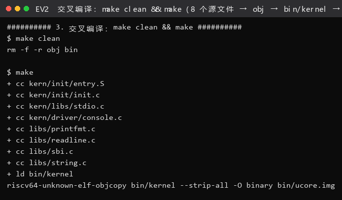

```
$ make qemu QEMU='qemu-system-riscv64 -kernel bin/ucore.img'
OpenSBI v1.0
...
Domain0 Next Address      : 0x0000000080200000
Domain0 Next Mode         : S-mode
...
(THU.CST) os is loading ...

（此后不退出，符合 kern_init 末尾 while(1) 死循环）
```

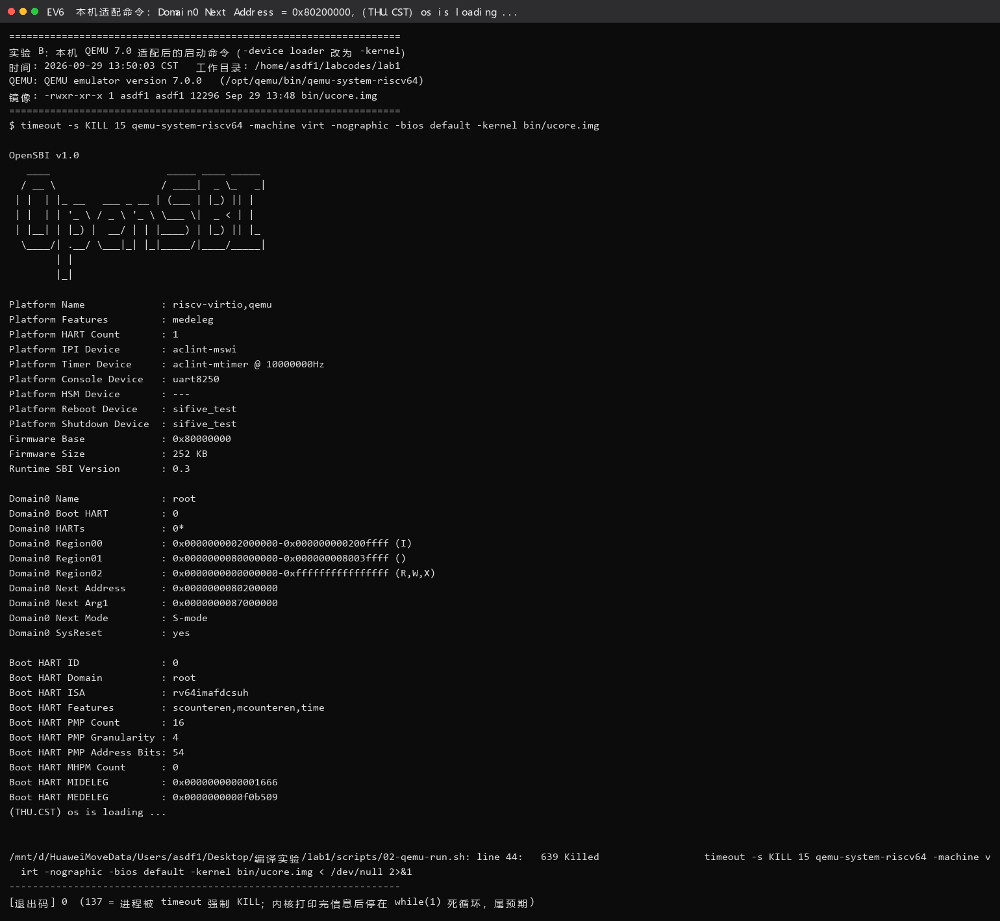

### （2）对照实验：教程原命令在本机 QEMU 7.0 上失效（同一份镜像、同一台机器，只差一个参数）

```
$ make qemu            # 教程原文命令（-bios default -device loader,file=...,addr=0x80200000）
Domain0 Next Address      : 0x0000000000000000      ← 交给地址 0，内核一行未执行
（无 (THU.CST) os is loading ...，15 秒后被 timeout 强杀）
```

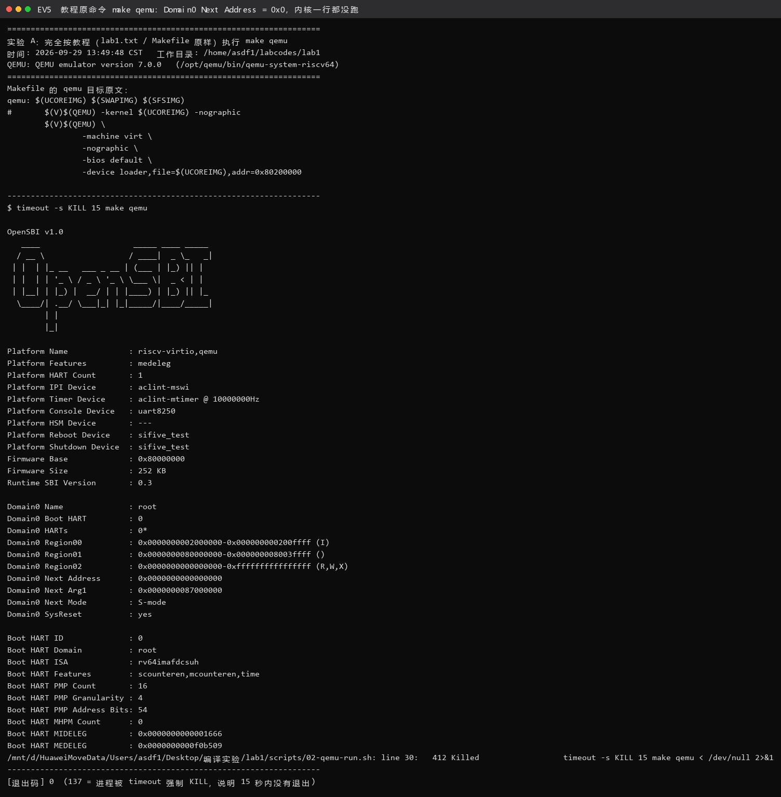

### （3）零源码改动证明 + 官方 `make qemu` 目标跑通

```
$ diff -r --brief "<收到的干净源码>" <工作副本>      # 无输出 ⇒ 源码零差异
$ make qemu QEMU='qemu-system-riscv64 -kernel bin/ucore.img'
Domain0 Next Address      : 0x0000000080200000
(THU.CST) os is loading ...
```

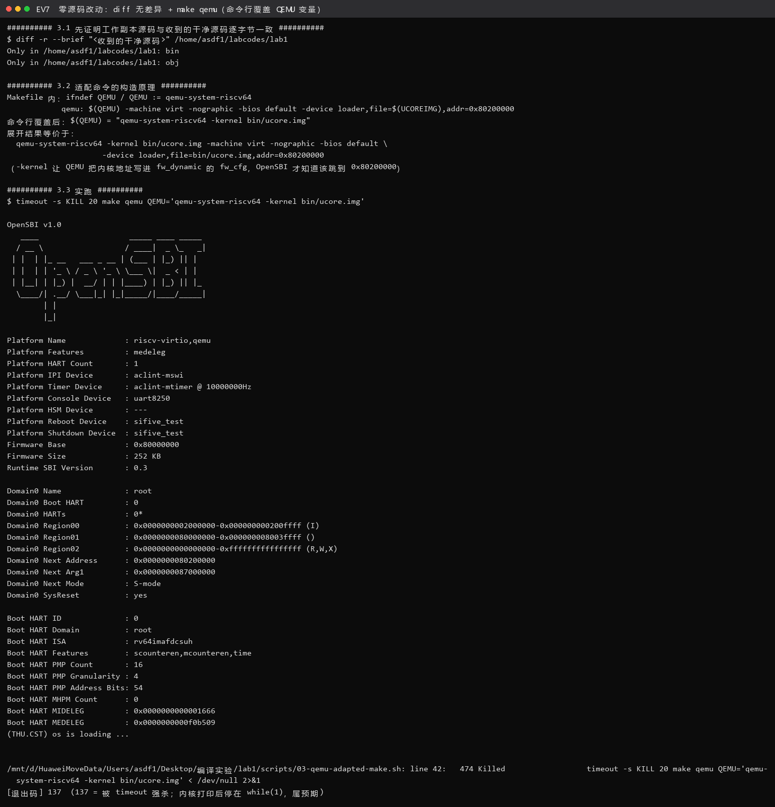

### （4）GDB 验证：控制权从固件移交内核（`0x80000000` → `0x80200000`）

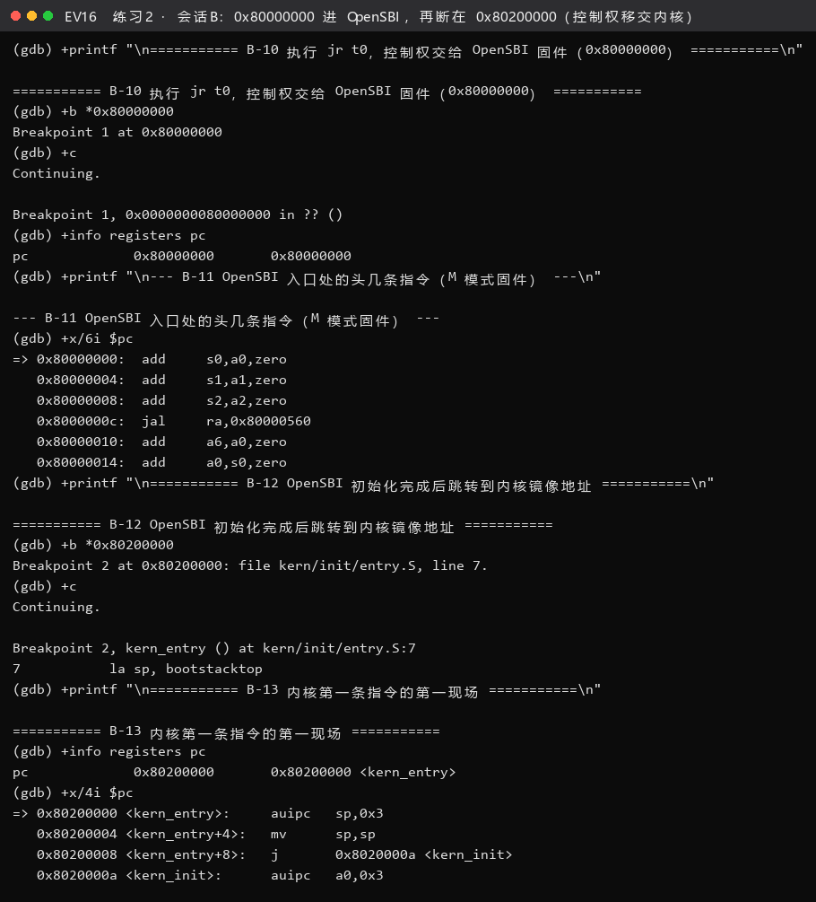

### （5）测试通过：小组 harness 用例 `ALL PASS`（本 lab 的等效验收）

> **说明（重要）**：lab1 的源码里**没有 `tools/grade.sh`**（harness 的静态检查也明确输出
> `[skip] 本 lab 未提供 tools/grade.sh`），因此本 lab **不跑 `make grade`**。
> 本组用"harness 用例 + 十一条自测判据 + 33 条证据台账"作为**等效验收**：

```
$ bash ucore2026/tests/run_lab1.sh
----------------------------------------------------------------
▶ 用例：lab1-T1 内核启动打印并进入死循环
[ok] contains: os is loading
[ok] not_contains: panic
== 静态检查：lab1 ==
[ok] 无 'YOUR CODE' 残留
[warn] 未在源码中发现学号 2410665（确认是否已替换）      ← 预期：lab1 无填空，无需替换
[warn] 未发现任何 'lab1' 注释，确认是否误删了框架注释      ← 预期：起始源码无框架注释可删
[skip] 本 lab 未提供 tools/grade.sh
================================================================
PASS=1  FAIL=0
ALL PASS (1 cases)
```

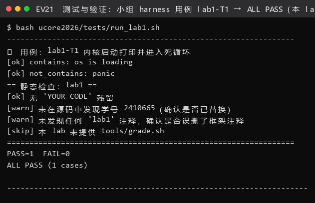

### （6）六组深度对照实验的结果（自己设计、自己验证）

| # | 实验 | 关键结果 | 截图 |
|---|---|---|---|
| 1 | `tail` vs `call` | `tail` → `c.j`（2 B，不写 `ra`）；`call` → `jal ra,8020000c`（写返回地址） | `shot-EV29-tail-vs-call.png` |
| 2 | `.bss` 两连 | 不引用 → 仍无 `.bss`（GC 丢弃）；引用 → `.bss = 0x1000`、`memset` 长度 `0x1000` | `shot-EV30-bss-experiment.png` |
| 3 | `ecall` 特权级陷入 | `ecall`（`0x80200492`）→ `pc = 0x80000408`，**`mstatus.MPP = 1`**；返回后回到 `0x80200496` | `shot-EV27-ecall-trap.png` |
| 4 | 设备树解析 | `magic = 0xd00dfeed`、`totalsize = 4882`、`/memory = 0x80000000 + 128 MiB` | `shot-EV28-dtb.png` |
| 5 | QEMU `-d in_asm` 特权级轨迹 | `Priv 3 →（mret@0x8000968e）→ Priv 1 @0x80200000 →（ecall）→ Priv 3 @0x80000408`；并独立印证复位向量 **6 条** | `shot-EV31-inasm-privilege.png` |
| 6 | 多 hart + 确定性重编译 | `-smp 4`：`Platform HART Count=4`、**`Boot HART = 1`**、内核仍打印；重编译前后 sha256 完全相同 | `shot-EV32-multihart.png`、`shot-EV33-reproducible-build.png` |

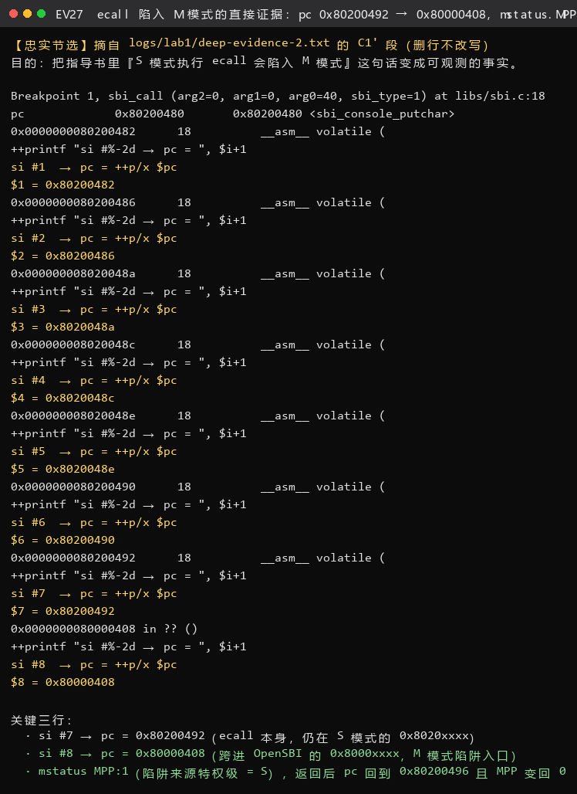
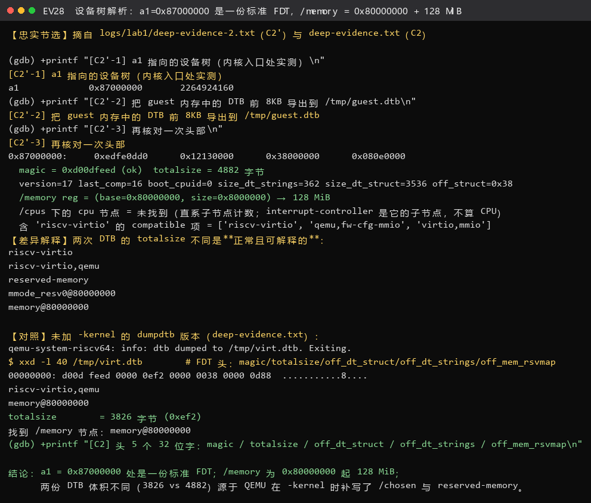
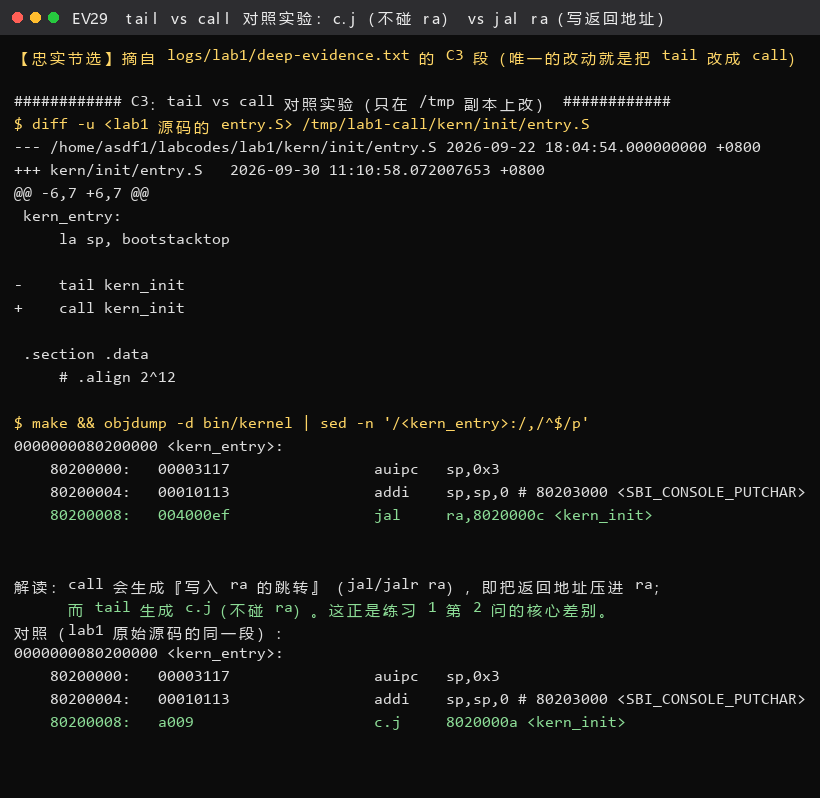
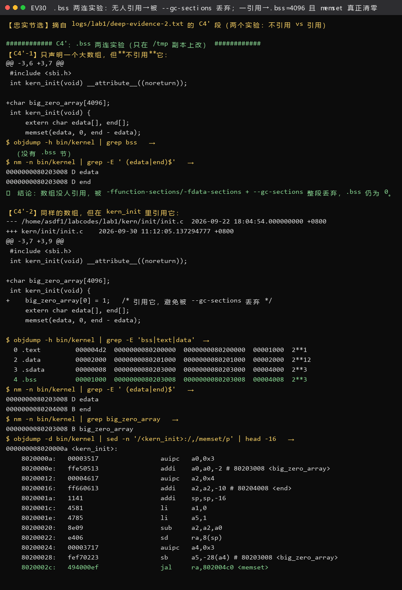
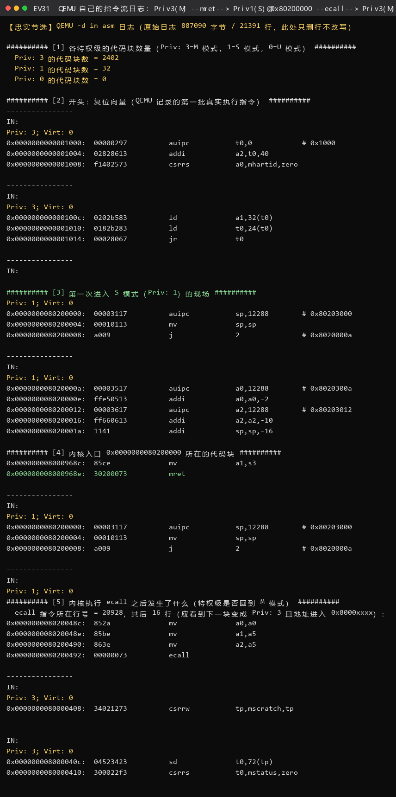
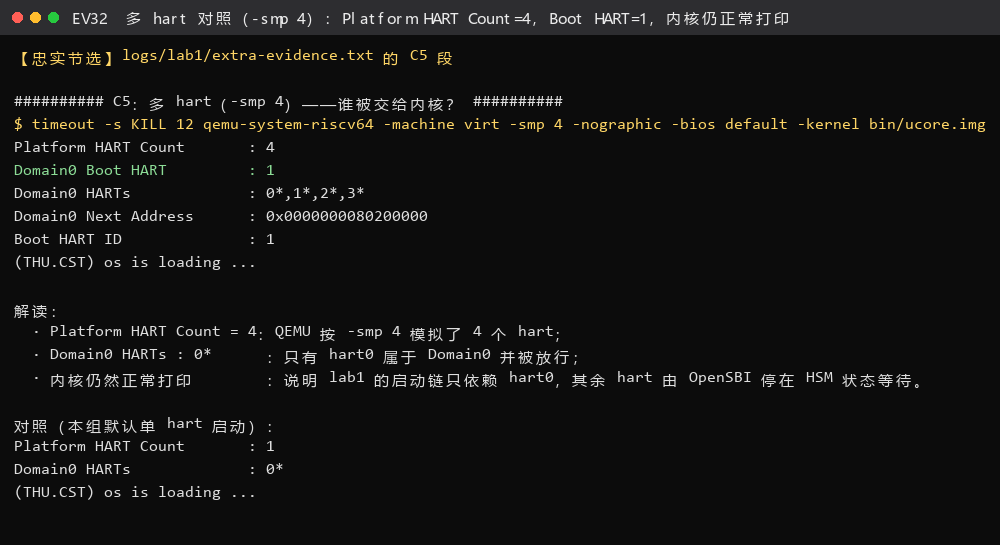
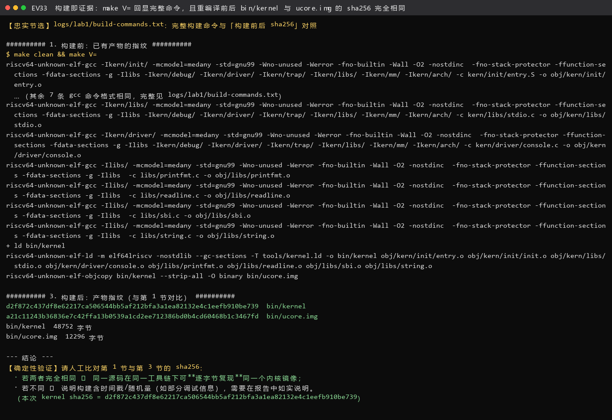

### （7）自测判据（十一条，逐条可现场重跑）

| # | 判据命令/观察点 | 通过条件 | 本次结果 |
|---|---|---|---|
| 1 | `make` | 无 error/warning，产出 `bin/kernel` 与 `bin/ucore.img` | ✅ |
| 2 | `readelf -h bin/kernel \| grep Entry` | `0x80200000` | ✅ |
| 3 | `objdump -d bin/kernel \| grep -A2 '<kern_entry>:'` | 第一条是 `auipc sp,...`（即 `la sp`） | ✅ |
| 4 | `nm bin/kernel \| grep bootstack` | `bootstacktop - bootstack == 8192` | ✅ |
| 5 | `qemu ... -kernel bin/ucore.img` | 同时含 `Domain0 Next Address : 0x80200000` 与 `os is loading` | ✅ |
| 6 | GDB 连接后 `info registers pc` | `0x1000`（复位地址） | ✅ |
| 7 | GDB `b *0x80200000` + `c` | 命中 `kern_entry () at kern/init/entry.S:7` | ✅ |
| 8 | GDB 在 `ecall` 上 `si` | `pc` 进入 `0x8000xxxx` 且 `mstatus.MPP == 1` | ✅ |
| 9 | 源码一致性（21 个源文件 sha256） | 与存档逐一相同 | ✅ 21/21 |
| 10 | 确定性重编译 | `make clean && make` 前后产物 sha256 不变 | ✅ |
| 11 | harness 等效验收 + 进程清理 | `ALL PASS (1 cases)`；`pgrep -c -f qemu-system-riscv64` = 0 | ✅ |

### （8）产物数据（供核对）

| 产物 | 值 |
|---|---|
| `bin/kernel`（ELF，带调试符号） | 48752 字节；`Entry point address: 0x80200000`；sha256 `d2f872c4…739` |
| `bin/ucore.img`（BIN，供加载） | 12296 字节 = 4096（`.text`+`.rodata`+页对齐填充） + 8192（内核栈） + 8（`.sdata`）；sha256 `a21c1124…67fd` |
| 段布局 | `.text` 1224 B @`0x80200000`；`.rodata` 624 B @`0x802004c8`；`.data` 8192 B @`0x80201000`；`.sdata` 8 B @`0x80203000`；**无 `.bss`** |
| 关键符号 | `kern_entry`=0x80200000、`kern_init`=0x8020000a、`bootstack`=0x80201000、`bootstacktop`=0x80203000、`edata`=`end`=0x80203008 |
| 内核保留的函数（`--gc-sections` 后） | 11 个：`kern_entry / kern_init / cputch / cprintf / cons_putc / printnum / vprintfmt / printfmt / sbi_console_putchar / strnlen / memset` |

> 注：`bin/kernel` 的体积与**构建目录路径长度**有关（调试信息内嵌 `DW_AT_comp_dir`），
> 实测同一份源码在不同目录下为 48752 / 48760 / 48792 字节；而 `bin/ucore.img` 在四种目录下
> sha256 恒为 `a21c1124…67fd`（逐字节可复现）。**可复现性判据以 BIN 为准，不以 ELF 体积为准。**

### （9）关键步骤截图全集

*(1) 环境自检：工具链版本与 QEMU 自带的 OpenSBI 固件（fw_dynamic，无 fw_jump）*
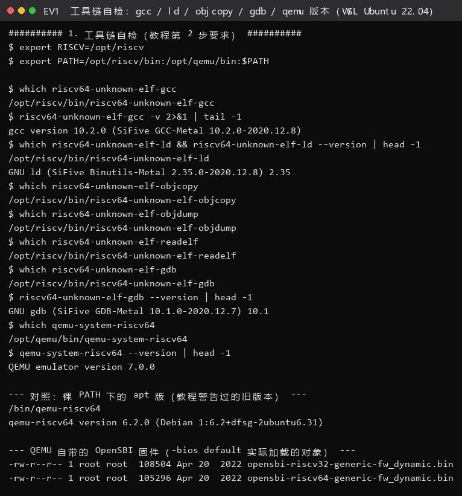

*(2) 构建产物与 ELF 头：`Entry point address: 0x80200000`*
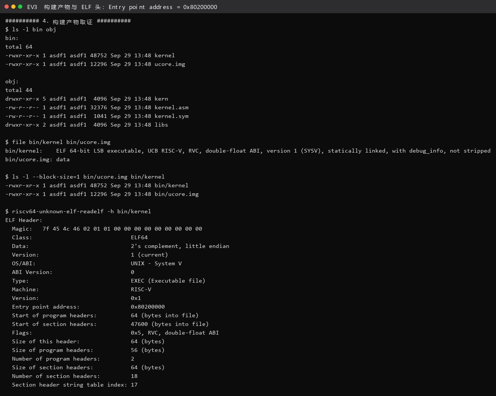

*(3) 练习 1 核心证据：`kern_entry` 反汇编 —— `la` = `auipc+addi`，`tail` = `c.j`*
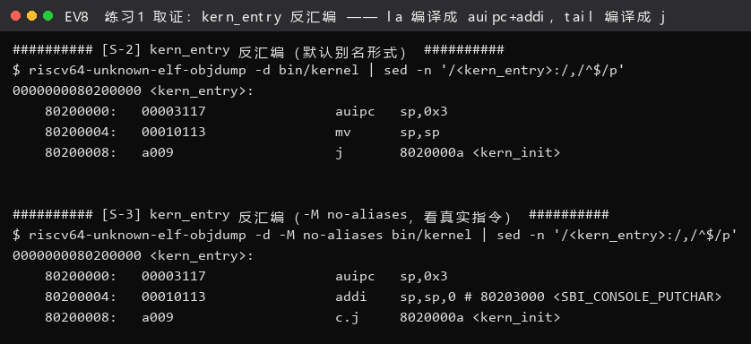

*(4) 练习 1 核心证据：符号表与内核栈边界（`bootstacktop - bootstack = 8192`）*
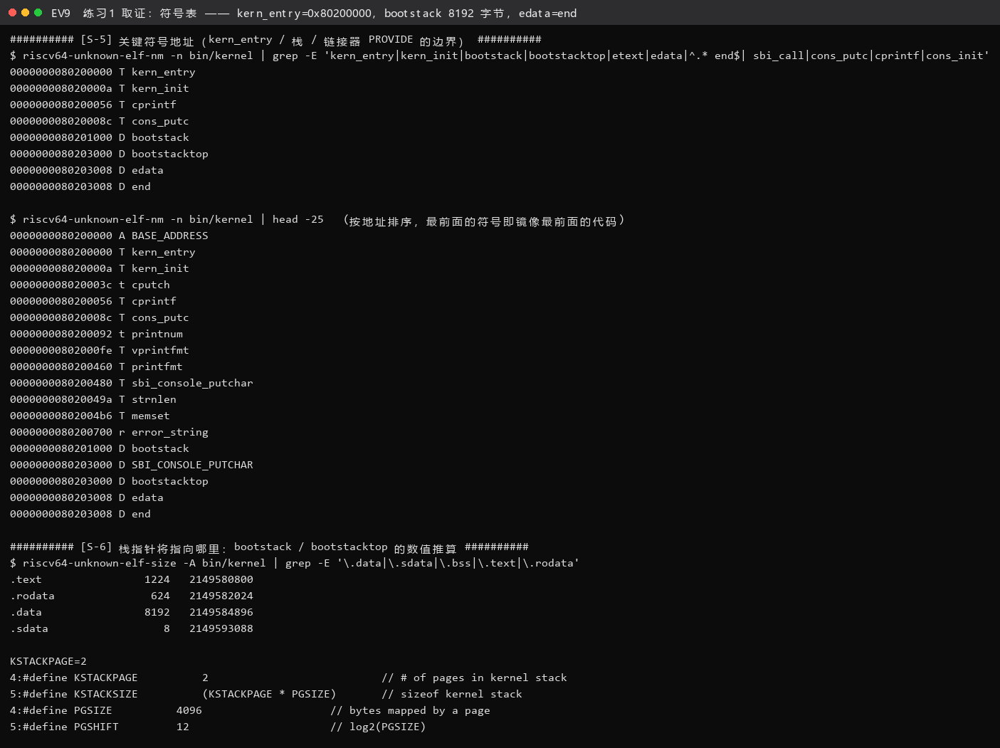

*(5) 练习 2 起点：GDB 连上时停在复位地址 `0x1000`，`b* kern_entry` 后断在 `entry.S:7`*
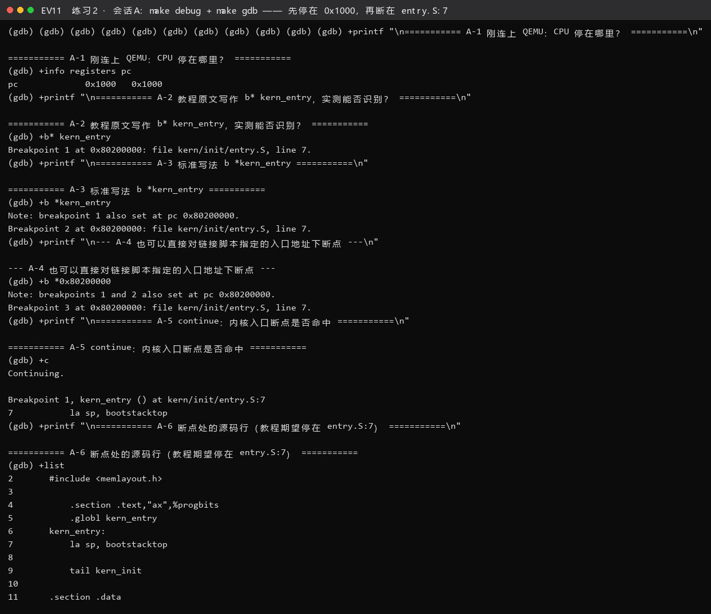

*(6) 练习 1/2 实证：单步执行 `la sp` 与 `tail kern_init`，`sp` 由 `0x8003def0` 变 `0x80203000`*
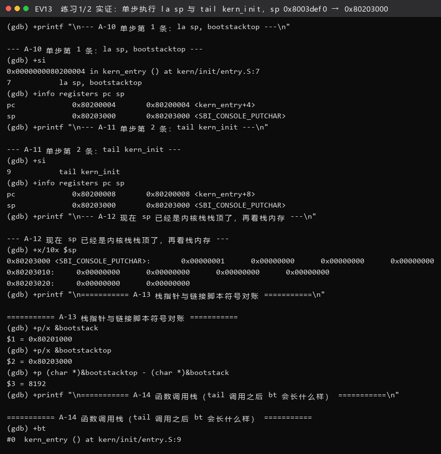

*(7) 练习 2 核心证据：加电复位现场 —— `0x1000` 处的 6 条指令与 `0x1018` 的固件地址*
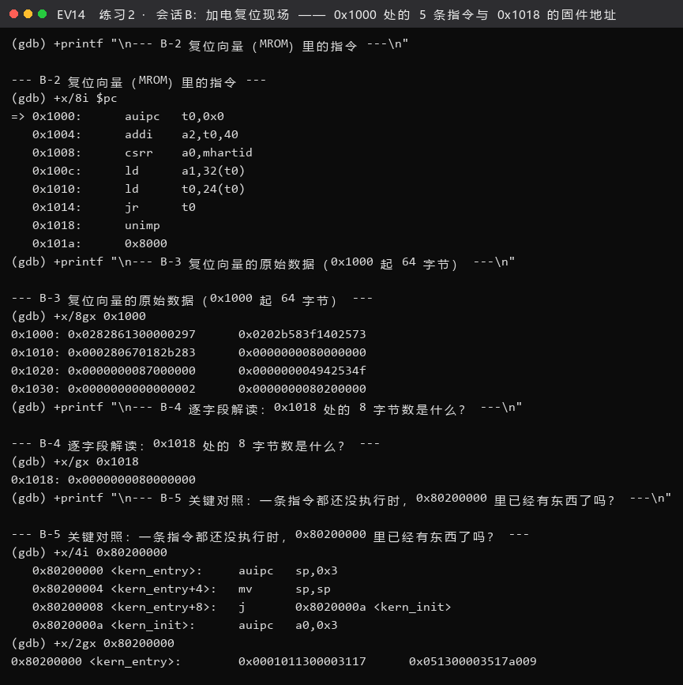

*(8) 练习 2 核心证据：前 5 条单步依次为 `0x1004/1008/100c/1010/1014`（停在第 6 条 `jr t0`）*
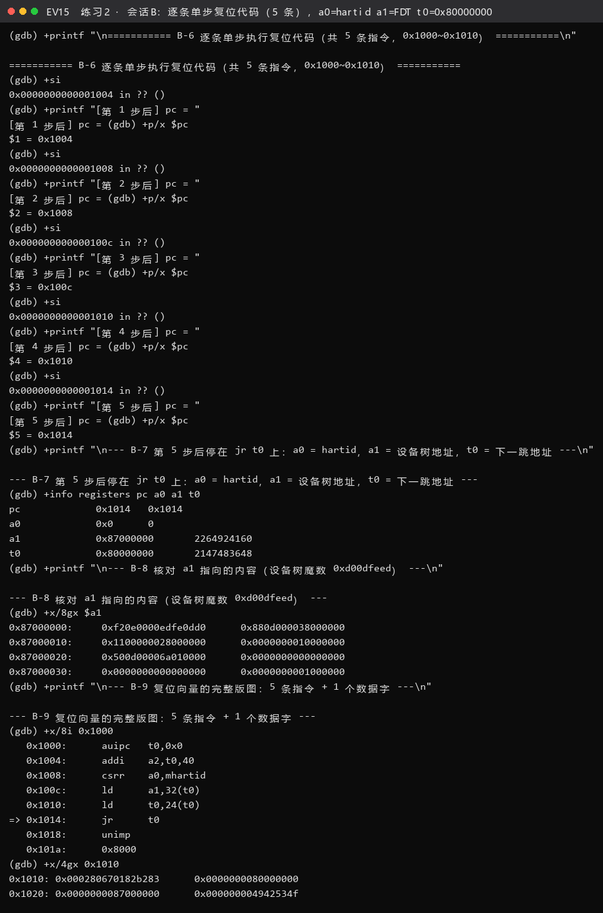

*(9) 练习 1 实证：`tail` 前后 `ra` 未变（尾调用不压返回地址）*
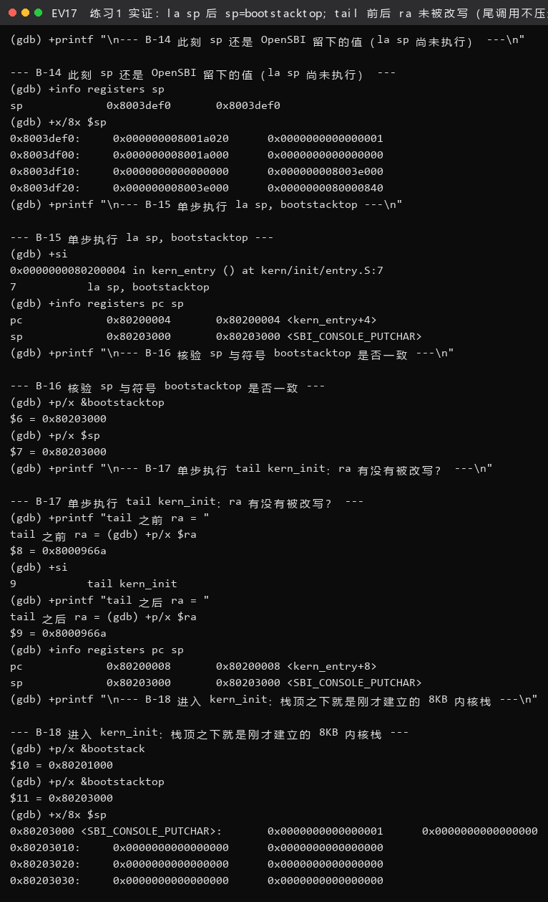

*(10) 练习 2 附加结论：`watch *0x80200000` 命中 0 次 —— 加载瞬间在 guest 侧不可观测*
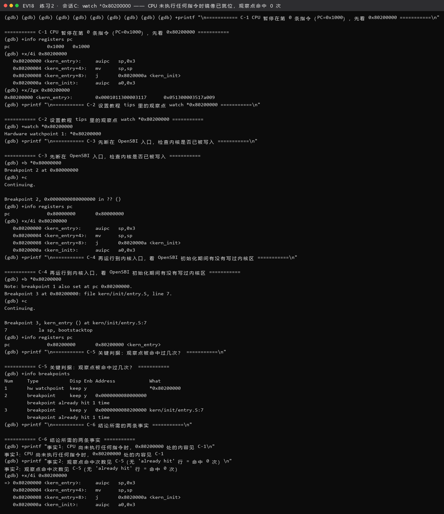

*(11) 排障根因（D1）：教程原命令下 `fw_dynamic_info.next_addr(0x1038) = 0x0`*
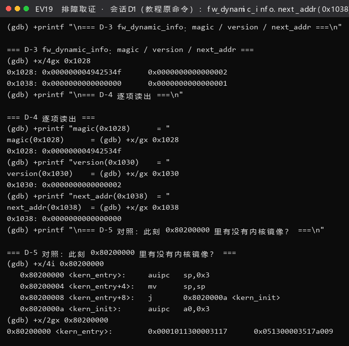

*(12) 排障对照（D2）：加 `-kernel` 后同一字段 = `0x80200000`（其余字段完全相同）*
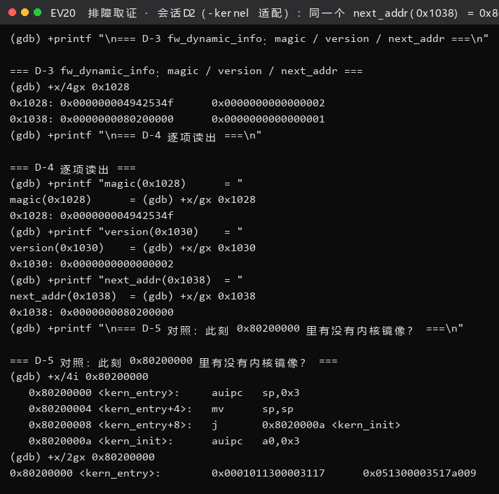

---

## 六、实验总结与收获

### 对操作系统的理解

#### 1. 本实验的重要知识点，及其与 OS 原理知识点的含义、关系与差异

| # | 实验中的知识点（本组实测落点） | 对应 OS 原理知识点 | 二者的含义 | 关系 | 差异（易混点） |
|---|---|---|---|---|---|
| 1 | 链接脚本描述内存布局（`BASE_ADDRESS=0x80200000`、段划分、`PROVIDE(etext/edata/end)`） | 可执行文件格式与内存映像/段 | 实验里"段"是**链接期**把 `.o` 的节拼成输出段；原理里"段"是程序运行时的**地址空间分区** | 原理解释"为什么这样分"（权限/初始化语义/空间效率），实验是"怎么让它真的落在这些地址上" | 原理常把 `.bss` 说成"运行时分配"，实验里 `.bss` **大小由链接器定死**，本构建实测为 **0 字节**（`edata == end`）；且实验把**内核栈**放进了 `.data` |
| 2 | 交叉编译流水线（`gcc -c` → `ld -T` → `objcopy -O binary`） | 编译—链接—加载全过程；重定位与符号解析 | 实验关注"产出了什么文件"；原理关注"符号如何解析、地址如何填进指令" | 实验是原理的一次真实实例化（`readelf -h` 的 `Entry point 0x80200000` 就是链接期决策的结果） | 原理多以"应用程序 + 动态链接"为例；本实验是**静态、无 libc、无重定位器**的镜像，`objcopy` 之后连 ELF 头都不存在；x86 版 lab1 的 bootblock/sign/`0x55AA` 在 riscv64 版**完全不存在** |
| 3 | bootloader（OpenSBI）与固件的职责；`-bios default` → `fw_dynamic` | OS 引导过程；BIOS/UEFI 与引导加载程序的分层 | 实验里 OpenSBI 兼任"固件 + 引导加载器"；原理里二者通常是两个阶段 | 同一职责在不同复杂度下的实现 | 真实 PC 的引导链更长且每步有校验；实验里"把内核放进内存"其实是 **QEMU 主机侧**完成的（实测镜像在 CPU 启动前就已就位） |
| 4 | RISC-V 特权级与 `ecall`（内核在 S、SBI 在 M）——**已拍到硬件级证据** | 特权级、系统调用与陷入机制 | 实验的 `ecall` 是"**内核→固件**（S→M）求助"；原理的系统调用是"**用户→内核**（U→S）求助" | 同一个硬件机制（`ecall`）在两级边界上重复出现 | 原理面向用户态；本实验**尚无用户态**（`misa` 有 U 位，但 QEMU in_asm 日志中 `Priv: 0` 块数 = **0**），所以 `ecall` 只是"内核向固件求助" |
| 5 | 打印链的层层封装：`cprintf → vcprintf → vprintfmt → cputch → cons_putc → sbi_console_putchar → ecall` | I/O 软件层次与设备驱动分层 | 实验是"自底向上搭积木"的最小版本；原理讲完整分层（中断处理→驱动→设备无关层→用户接口） | 实验是原理分层的**最小可运行实例** | 原理的驱动层要处理中断、缓冲、DMA；实验里驱动层是 `cons_putc` 一行直通 SBI，`cons_init/kbd_intr/serial_intr` 全是空函数 |
| 6 | 内核栈的建立（`.align PGSHIFT` + `.space KSTACKSIZE` + `la sp`） | 执行流栈、函数调用约定与栈帧 | 实验里"栈"= 链接器预留的静态内存 + 一个寄存器约定；原理里"栈"是每个线程/进程私有的运行时资源 | 实验给出了原理里"栈从哪来"的最底层答案 | 原理强调"每线程一个栈"与"栈溢出保护"；本实验只有一个全局内核栈且**无守卫页**（`satp=0` 无分页），溢出会静默破坏 `.text/.rodata` |
| 7 | C 运行环境的建立：`memset(edata, 0, end - edata)` 清 BSS | 程序启动过程、C 运行时（`crt0`） | 实验里"清零"由内核**手动**完成；应用程序里由 `crt0`/加载器完成 | 同一需求的两种实现位置：**谁负责把 0 放进 bss** | 实测本构建 `.bss` 长度为 **0**，这行 `memset` 实际清除 0 字节；两连对照实验证明**代码写法正确、只是恰好没有 bss 需要清** |
| 8 | ELF 与 BIN 的差异 | 可执行文件格式、加载器、符号与调试信息 | 实验里 ELF 给调试器（48 KB 带符号），BIN 给加载器（12 KB 纯字节） | 同一程序的两种表示，用途不同 | 原理里 ELF 由操作系统加载器解析；本实验**没有可依赖的加载器**（OpenSBI 只搬字节），故退化为 BIN + 固定地址布局 |
| 9 | 页对齐与填充（`. = ALIGN(0x1000)` 使 BIN 多出 2248 字节） | 页式内存管理、段对齐代价 | 实验量化了"对齐要花多少钱"；原理讲"为什么要按页对齐" | 原理给出动机，实验给出成本 | 本实验 `satp = 0`，**分页尚未启用**，这次对齐是"为 lab2 的页表提前立的规矩" |
| 10 | GDB 远程调试内核（QEMU `-s -S` + `target remote`） | （原理无直接对应）调试与可观测性 | 实验里这是看清机器内部状态的手段之一 | 工程能力，是原理被验证的前提 | 调试对象是"环境"本身，必须"远程 + 停机"；且 **gdb 读 CSR 是 QEMU 直接读 CPU 状态、不经特权检查**，不能据此判断特权级 |
| 11 | **QEMU `-d in_asm` 指令流日志（本组新增的第三方视角）** | （原理无直接对应）模拟器/指令级追踪与验证 | 实验里它是"不依赖调试器"的独立证据源：连 `Priv`（特权级）都被记录下来 | 与 GDB 观察互为独立证据链 | 原理课不会提到模拟器日志；但这正是"可复现实验"的关键工具——**同一事实有两条互不依赖的证据链才算可靠** |
| 12 | **设备树（DTB）作为硬件描述** | 硬件描述与内核解耦（ACPI / DT 两条路线） | 实验里 `/memory`、`cpu@0`、`reserved-memory` 都写在 DTB 里；原理里硬件信息由固件以数据结构交给内核 | 实验是原理"数据驱动硬件发现"的具体实例 | 原理（x86 视角）讲 ACPI；riscv64 走 **DT** 路线。本实验只解析了头部与 `/memory`，完整解析是 lab2 的任务 |
| 13 | 常量字符串存放在 `.rodata`（`0x802004c8`） | 只读数据段、字面量、内存保护 | 实验里它是一段只读、随镜像加载的字节 | 体现"常量放 rodata"的收益（可共享、可保护） | 本实验**无写保护**（不分页），"只读"目前只是约定而非硬件强制 |

#### 2. OS 原理中很重要、但本实验没有对应上的知识点

| # | 原理知识点 | 本实验的状态 | 为什么没有（以及何时会有） |
|---|---|---|---|
| 1 | **虚拟内存与分页**（页表、MMU、TLB、缺页） | **完全没有**。实测内核入口处 `satp = 0x0` ⇒ bare 模式，物理地址即被访问地址 | 教学上把分页放到 lab2；也正因为没有地址翻译，`0x80200000` 才必须等于物理地址 |
| 2 | **进程/线程与调度** | 完全没有。整个执行流只有一条：`kern_entry → kern_init → while(1)` | 需要先有 trap（lab3）与进程管理（lab4） |
| 3 | **中断与异常处理框架** | 完全没有。实测 `mstatus.MIE/SIE = 0`（中断关闭），内核里没有 trap 符号 | trap 是 lab3 的主角；本章连中断都未开启 |
| 4 | **并发与同步**（锁、原子、竞态） | 完全没有。默认单 hart（实测 `mhartid = 0`）；虽然 `-smp 4` 下 4 个 hart 同属 Domain0，但内核只被引导 hart 执行一次 | 并发问题在单核单流的最小内核里不存在；lab6/lab7 才引入 |
| 5 | **动态内存管理**（堆、`malloc/free`、碎片） | 完全没有，所有内存由链接器静态分配 | 动态分配建立在物理页管理之上（lab2） |
| 6 | **文件系统与持久化存储** | 完全没有。实测 QEMU 命令行**没有任何磁盘设备**，镜像由 `-kernel` 直接进内存；教程"内核被加载到硬盘"在此配置下**不成立** | 文件系统是 lab8/lab9；没有驱动就没有文件系统 |
| 7 | **用户态与系统调用的完整链路** | 没有用户态。QEMU in_asm 日志里 `Priv: 0` 块数 = 0，是**硬证据** | 需要进程与 trap 框架（lab3–lab5）。"有 `ecall` 就等于有系统调用"是误解：取决于发生在哪个特权边界 |
| 8 | **设备驱动与中断驱动 I/O** | 只有"输出一个字符"这一条最短路径，且绕过全部硬件细节（直接问固件要服务） | 本实验刻意用 SBI 服务代替写驱动。⚠️ 另注：`sbi.h` 声明 7 个函数，`sbi.c` 只实现 3 个（`sbi_call`/`sbi_console_putchar`/`sbi_set_timer`），未实现的 5 个是 `sbi_query_memory`、`sbi_send_ipi`、`sbi_clear_ipi`、`sbi_shutdown`、`sbi_console_getchar`；因无人引用被 `--gc-sections` 丢弃，链接才成功——**一旦有人调用 `getchar()`，链接就会报未定义符号** |
| 9 | **内存保护与隔离**（页权限、内核/用户边界、栈守卫页） | 没有。`satp=0`，所有地址可读写执行；内核栈上下无守卫页 | 需要分页（lab2）与进程隔离（lab4） |
| 10 | **启动安全与信任链**（Secure Boot、度量、镜像校验） | 完全没有。QEMU 会加载任何指定镜像 | 实验要的是可反复试验；这是真实启动链里最复杂的部分 |
| 11 | **多核（SMP）启动与 hart 管理** | 只看到"被引导的那一刻"：复位代码把 `mhartid` 放进 `a0`；`-smp 4` 实测 `Boot HART = 1`、4 个 hart 同属 Domain0。**其余 hart 如何被唤醒（HSM/IPI）本实验没有体现** | 单 hart 足够跑通最小内核；完整多核启动是 lab6 之后的话题 |
| 12 | **ABI 与调用约定的完整体系**（callee-saved、浮点规则、变参实现） | 只触及"建立 `sp`、不破坏 `ra`、16 字节对齐"；变参靠手写 `stdarg.h` + `vprintfmt` | 内核里没有标准库，需要什么就得自己造——这正是 lab1 最"硬"的部分 |

---

### 一些对gitbook内容的理解与思考

**① 把"启动"抽象成"三份契约"，而不是一堆地址。**
初读本章时，我们的注意力被 `0x1000 / 0x80000000 / 0x80200000` 三个数字占据；
真正让我们"读懂"本章的，是把它们归纳成三份**接口契约**（布局、交接、服务，见 §三 2.1）。
这个抽象有两个实际好处：其一，它解释了**为什么每一步都需要判据**——
契约的验证方式就是"检查双方是否都按约定行动"；其二，它可以直接迁移到后续实验：
lab2 的"页表契约"（内核虚拟地址 ↔ 物理地址）、lab3 的"trap 契约"（`stvec` 与上下文保存格式）
本质上是同一件事。**这套模型是我们在本章最大的收获。**

**② "接口优先于行为猜测"——一次排障方法的沉淀。**
`make qemu` 卡住时，最诱人的做法是"猜 QEMU/OpenSBI 干了什么"；而正确的动作是
**去找上下游之间那个显式的接口字段**（`fw_dynamic_info.next_addr`），
然后做"只改一个变量"的对照实验（D1 vs D2）。
这条经验的普适形式是：**凡是"上游把控制权交给下游"的地方，必然存在一个显式接口
（寄存器/结构体/字段）；排障时优先读接口，而不是猜行为。**
我们把它写成可复用的三步法：**定位接口 → 单变量对照 → 用外部资料交叉印证**。

**③ "构建即证据"——确定性重编译的三重意义。**
一个起初只为"补齐构建命令"的实验，意外给出了本报告最强的可复现性结论：
`make clean && make` 前后 `bin/kernel` 与 `bin/ucore.img` 的 **sha256 完全相同**。
它同时支撑三件事：① 报告的体积账/符号表/反汇编结论**可被复算**（别人重编译拿到的是同一文件）；
② 证明取证过程**没有污染工作副本**（否则哈希必变）；③ 使"源码零改动"从声明升级为可验证事实
（21/21 文件哈希 + 产物哈希双重锁定）。**这是"证据工程"的一部分，而不是构建脚本的副产品。**

**④ 一个"空 `.bss`"暴露出的两种思维差异：看意图 vs 看事实。**
`kern_init` 里那句 `memset(edata, 0, end - edata)` 在教材语境下"当然是在清 BSS"，
但本构建实测 `edata == end`，它清零 0 字节。更关键的是**为什么**：
两连实验证明，lab1 中的零初始化全局量**因为无人引用而被 `--gc-sections` 丢弃**——
不是因为"源码里没有这样的变量"。这提醒我们：**判断一行代码有没有意义，
要看变量的实际取值与链接结果，而不是看它"应该"做什么。**
这条认识后来直接影响了我们读 lab2 的方式（先问"这段内存真的存在吗"）。

**⑤ 双视角验证：为什么"两条独立证据链"比"一条更强的证据"更有价值。**
关于"S 模式 `ecall` 陷入 M 模式"，我们本可以只用 GDB 单步（已经很硬）。
但我们又用 QEMU 自己的 `-d in_asm` 日志做了一遍：日志里
`Priv 3 →（mret）→ Priv 1 →（ecall）→ Priv 3` 清晰可见，且**不依赖我们对 GDB 的解读**。
两次独立观测互相印证后，我们才敢在报告里下断言。
这条经验已写进我们的跨 lab 纪律：**凡关键结论，至少要有两条独立证据链。**

**⑥ 对教材/参考资料的两处实测修正，以及"不照搬"的自觉。**
其一，教材说"代码是地址相关的（指令里写死绝对地址）"，而实测本构建 `lui` 出现 0 次、`auipc` 15 次，
生成的是 **PC 相对**代码——因此"必须加载到固定地址"的原因是**上游契约 + 无重定位器**，
而不是"搬走就寻址错"。
其二，教材链接脚本注释称 `*(.text.kern_entry)` 决定入口位置，实测 `entry.o` 里根本没有该节，
入口落位靠的是**链接时输入文件顺序**（`entry.o` 排第一）。
两处都按"实测优先、并保留教程原文"的方式写进报告。
同时我们发现：三份参考资料里两份是 **x86 版**（`0x7C00`/A20/GDT/`0x55AA`），
数字**一个都不能照搬**（详见附录 B）——**"参考"不等于"移植"**。

---

### 提示词工程：可复用的方法论

指导书 lab0.5 给了四条原则（**基于任务而非函数 / 边界清楚 / 要求可验证 / 保留真实语义**）
与四段式骨架（`[PROMPT] [RELY] [GUARANTEE] [SPECIFICATION]`）。本章没有代码填空，
于是我们把它们**迁移到"取证类任务"上**，并把证据要求与禁止事项写进四段式的对应段落——这是本组对提示词用法的具体扩展：

| 段落 | 作用 | 我们新增/强化的理由 |
|---|---|---|
| `[PROMPT]` | 任务 + 操作要求 + 输出要求 | 保留指导书原样；在"操作要求"里固定写上**禁止修改的目录** |
| `[RELY]` | 最小可信上下文（宏/结构/地址/命令） | 坚持"地址、符号、字段一律取自实测"，绝不写"大概是" |
| `[GUARANTEE]` | 交付清单（本章是**文件 + 断言**，而非函数签名） | 明确写出"本章无代码填空，故 `[GUARANTEE]` 列的是证据文件与断言" |
| `[SPECIFICATION]` | `Pre/Post-Condition` + `Case 1/2/3` | **`Case 2` 固定留给"未观察到/失败"路径**，防止只写顺耳结论 |
| **证据要求（落在 `[SPECIFICATION] → Requirements`）** | 要求"每个结论必须给出：命令原文 → 原始输出 → 文件路径" | 让 AI 的产出**天然可复核**；没有这一条，AI 很容易只给结论 |
| **禁止事项（落在 `[SPECIFICATION] → Requirements` 与 `[GUARANTEE]`）** | 显式列出禁止事项：改源码、用记忆填参数、用上次输出冒充本次、使用"应该/通常" | 把"防幻觉"从口头要求变成提示词里的硬约束 |

**工作流程：指导书五步 + 我们的第 0 步。**
lab0.5 给的是"理解任务 → 梳理需求 → 编写提示词 → 生成和验证 → 迭代优化"。
我们在最前面加了 **第 0 步：先定判据（怎么算成功？用什么命令证明？）**。
理由是本章的教训：如果"成功"没有被定义清楚，AI 极容易用一句"已成功启动"糊过去；
而一旦判据（如 `Domain0 Next Address = 0x80200000` 且屏幕出现 `os is loading`）先定下来，
提示词的 `[GUARANTEE]` 与后续验收就都有了锚点。**先定判据，再写提示词**，这是我们最想推荐的一条。

**一个我们自己踩过的反例**（可与 lab0.5 的反例对照）：
最初我们给 AI 的提示词是"帮我用 GDB 看一下内核启动过程"。结果：它给了一串命令，
但**没有留下任何可复核的文件**，而且把复位向量写成"5 条指令"。
改进后的写法是：明确交付物（`logs/gdb/lab1-session-B.gdb` + `.txt`）、
明确断言（`pc==0x1000`、6 条指令、命中 `entry.S:7`）、明确禁止事项（不改源码、不凭记忆）。
**同一件事，提示词从"一句话"变成"四段+两段"后，产出从"看起来像"变成了"可被脚本复核"。**

---

### 对思考题的延伸思考

> 以下八问是我们自己从 lab1 推出去的——每题都尽量给出机制层面的回答。

1. **如果 `BASE_ADDRESS` 改成 `0x80201000`（挪一页），会怎样？**
   链接仍会成功，但 QEMU/OpenSBI 依然按 `next_addr = 0x80200000` 跳到旧地址 ⇒ 执行的不是我们放在那里的内容 ⇒ 立刻跑飞。
   这从反面印证了**布局契约**：链接地址不是"随便选"，而是与上游约定绑定的。
2. **如果改用 `-mcmodel=medlow`？**
   `medlow` 假设代码与数据落在 ±2GB 低地址区，常用 `lui/addi` 形成绝对地址；
   我们的镜像在 `0x80200000`（约 2.1 GB），容易出现重定位截断或链接错误，
   更会**失去 PC 相对的可整块搬迁特性**。本实验用 `medany` 正是为了避开这两点。
3. **如果本机 `-bios default` 是 `fw_jump` 而不是 `fw_dynamic`？**
   `fw_jump` 的跳转地址**写死在固件里**（QEMU 编译期设为 `0x80200000`），
   于是教程原命令 `-device loader,file=...,addr=0x80200000` 会直接可用。
   **同一个 Makefile，两种固件，两种命运**：这说明"环境差异"必须写进报告。
4. **如果内核镜像比可用内存还大（例如在 `.data` 里放一个 64 MB 数组）？**
   镜像会顺利生成（BIN 会真的带上那 64 MB 的 0），但 QEMU 把它搬进 `0x80200000` 时会越过内核可用区间；
   而 `satp = 0` 意味着**没有地址翻译也没有越界保护**，
   结果是覆写其他内存区域而**不会报错**——这是"最小内核"最危险的地方之一。
5. **启用分页以后（lab2），`0x80200000` 还是"物理地址"吗？**
   在 lab1 它既是虚拟地址也是物理地址（`satp = 0`）。lab2 建立内核页表后，
   内核通常运行在"高地址虚拟空间"，物理地址要靠 `PADDR()`/`va_pa_offset` 换算；
   而 `edata/end` 这些链接期符号**仍是虚拟地址**——这会成为 lab2 的第一个坑。
6. **如果内核栈溢出（`sp` 越过 `0x80201000`）会怎样？**
   栈向下增长，`0x80201000` 之下就是 `.rodata/.text`（实测 `.rodata` 结束于 `0x80200738`），
   而**没有守卫页、没有分页保护** ⇒ 溢出会**静默改写代码段**，
   表现成"莫名其妙的指令错乱"而不是"栈溢出异常"。这解释了后面实验为什么必须尽快把页表建起来。
7. **为什么不把 `hartid`、设备树地址放进全局变量，而是用 `a0/a1/a2` 传？**
   因为内核入口**还没有栈、数据段也还没初始化**（BSS 甚至还没清），此刻"全局变量"并不可靠；
   寄存器是唯一"已经存在"的通道。这也是 boot protocol 必须用寄存器传参的根本原因——
   **传参方式的可用性由启动阶段的资源状态决定**。
8. **如果把 `tail kern_init` 换成 `call kern_init`，且 `kern_init` 最后 `return` 会怎样？**
   实测 `call` 会写 `ra = 0x8020000c`（`entry.S` 里的下一条指令）。若 `kern_init` 真的返回，
   控制流会跳到 `0x8020000c`——那里已不是有效代码，行为未定义。
   **这说明 `__attribute__((noreturn))` 不是"礼貌标注"，而是架构约束的一部分。**

---

### 小组内 AI 协作开发的经验

1. **接口优先于行为猜测**：`make qemu` 卡住时，正确答案不在"多试几个 QEMU 参数"，
   而在 `fw_dynamic_info.next_addr` 这个字段。**凡是"上游把控制权交给下游"的地方，
   必然存在显式接口；排障时优先读接口。**
2. **证据要分级，AI 的输出不能当证据**：命令原文+原始输出（可脚本复核）> 静态取证 >
   截图 > 记忆/推断。我们要求 AI 产出的每一句结论都能指向 `logs/` 里的某一行原文。
   **AI 很擅长把"看起来合理"写成"确定"，而报告的价值恰恰在于把"确定"降级为"可复核"。**
3. **"没看到"也是一种结论**：`watch *0x80200000` 命中 0 次并非失败，
   它推出了更强的结论——**镜像在 CPU 启动前就已就位，guest 侧不存在"加载瞬间"**。
   我们把"未观察到"设为提示词 `[SPECIFICATION]` 里的 `Case 2`，强制它必须被写成结论。
4. **AI 也可以帮我们改正教材**：本报告有两处结论是**实测修正教材**的
   （PC 相对寻址；`entry.o` 无 `.text.kern_entry` 节、入口靠链接顺序），
   外加一处我们自己的计数错误（复位向量 5 → 6 条）。**AI 加速的是"验证"，不是"相信"。**
5. **把"防幻觉"写进提示词，而不是靠事后校对**：我们把证据要求写进 `[SPECIFICATION] → Requirements`、
   把禁止事项写进 `[GUARANTEE]`——前者要求"每条结论给出命令/输出/路径"，后者显式禁止
   "凭记忆填参数、用上次输出冒充本次、使用应该/通常"。加入这两条约束后，
   AI 的产出从"读起来像报告"变成"可以直接进台账"。
6. **失败要留档，因为它定义了后续方法**：第一次 `ecall` 实验没跨过 `ecall`、
   第一次 in_asm 检索全为 0、`.bss` 实验第一次"没出现 .bss"——
   三次"失败"分别催生了"以判据收尾""改用 Priv 字段检索""两连对照实验"。
   **把失败写进日志，等于给后来者留下"为什么这么做"的说明。**


## 以上是我们组本次lab1实验的完整记录，请老师助教批评指正！


